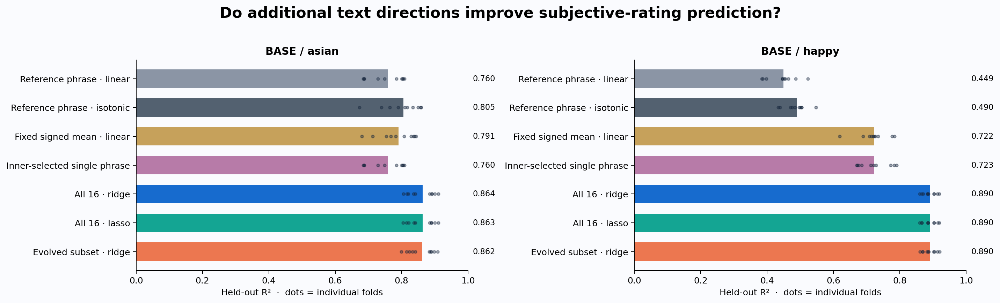
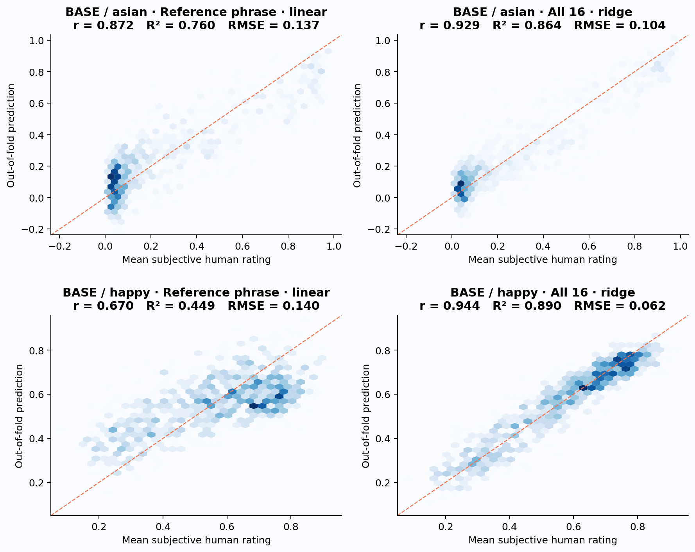
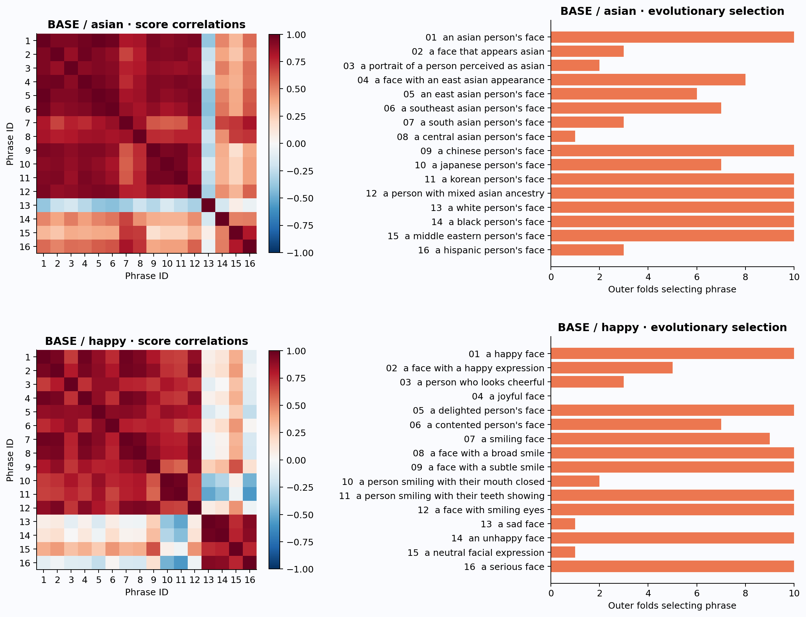
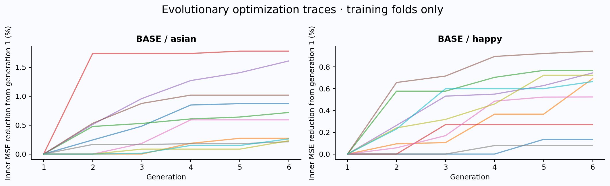

# FG-CLIP 2 prompt-space transfer of subjective face impressions

All numbers below predict the **mean participant slider rating**. The `asian` target is perceived Asian appearance; it is not verified ethnicity. `happy` is perceived expression, not a person's internal state.

## Design

Frozen image/text encoders; 16 fixed descriptions per impression, including the supplied reference as phrase 1. IDs 1–12 describe positive variants; 13–16 add contrasting or neutral directions. Prompt sets were written before viewing their correlations. Linear readouts operate on the 16 independent agreement logits; no softmax across phrases.

Ten shuffled outer folds produce exactly one held-out prediction for every face. Five inner folds tune ridge alpha, lasso alpha fraction, single-phrase choice and evolutionary subsets by mean squared error. Scaling and calibration are fitted separately within every training fold. Outer labels are unavailable to search. Full CV here means all folds/all faces, not leave-one-out CV or exact population accuracy. The same outer splits are used for every method and architecture.

Evolution starts with the reference-only and all-phrase subsets plus random subsets; each generation retains elites and creates crossover/bit-flip mutations. Phrase 1 is always retained. Subset and ridge alpha are selected jointly. This is a budgeted search, not exhaustive subset enumeration. The isotonic reference control tests whether nonlinear calibration of one phrase accounts for ensemble gains. The fixed signed mean control averages training-standardized scores, with signs +1 for IDs 1–12 and −1 for 13–16.

## Held-out performance



| Architecture / impression | Method | Pearson r | Spearman ρ | R² | RMSE | MAE |
|---|---|---:|---:|---:|---:|---:|
| BASE / asian | Reference phrase · linear | 0.8716 | 0.7945 | 0.7596 | 0.1375 | 0.1103 |
| BASE / asian | Reference phrase · isotonic | 0.8974 | 0.7864 | 0.8051 | 0.1238 | 0.0865 |
| BASE / asian | Fixed signed mean · linear | 0.8894 | 0.7644 | 0.7910 | 0.1282 | 0.1022 |
| BASE / asian | Inner-selected single phrase | 0.8716 | 0.7945 | 0.7596 | 0.1375 | 0.1103 |
| BASE / asian | All 16 · ridge | 0.9293 | 0.8334 | 0.8636 | 0.1036 | 0.0799 |
| BASE / asian | All 16 · lasso | 0.9292 | 0.8331 | 0.8634 | 0.1037 | 0.0800 |
| BASE / asian | Evolved subset · ridge | 0.9284 | 0.8313 | 0.8619 | 0.1042 | 0.0803 |
| BASE / happy | Reference phrase · linear | 0.6703 | 0.6375 | 0.4493 | 0.1396 | 0.1159 |
| BASE / happy | Reference phrase · isotonic | 0.7007 | 0.6196 | 0.4904 | 0.1343 | 0.1092 |
| BASE / happy | Fixed signed mean · linear | 0.8500 | 0.8262 | 0.7225 | 0.0991 | 0.0800 |
| BASE / happy | Inner-selected single phrase | 0.8503 | 0.8478 | 0.7231 | 0.0990 | 0.0789 |
| BASE / happy | All 16 · ridge | 0.9435 | 0.9415 | 0.8902 | 0.0623 | 0.0491 |
| BASE / happy | All 16 · lasso | 0.9434 | 0.9413 | 0.8901 | 0.0624 | 0.0491 |
| BASE / happy | Evolved subset · ridge | 0.9436 | 0.9416 | 0.8904 | 0.0623 | 0.0491 |

## Added value of the full ridge ensemble

Intervals are 95% paired face-bootstrap intervals of the fixed out-of-fold predictions. They condition on these fitted folds; they do not include variation from refitting/search, participant clustering or related generated identities. Treat them as descriptive uncertainty, not definitive significance tests.

- **BASE / asian:** raw reference r=0.8720; OOF r 0.8716 → 0.9293; ΔR²=+0.1040 (CI +0.0881, +0.1223); RMSE reduction 24.7%. Ridge versus isotonic-reference RMSE reduction CI: [+0.0144, +0.0262] slider units. Full seven-method nested CV: 0.45 s, excluding encoding/bootstrap/final refit.
  Evolution versus full ridge: ΔR²=-0.0018 (CI -0.0034, -0.0002); selected subsets contain 10–13 phrases (median 11).
- **BASE / happy:** raw reference r=0.6720; OOF r 0.6703 → 0.9435; ΔR²=+0.4410 (CI +0.4044, +0.4818); RMSE reduction 55.4%. Ridge versus isotonic-reference RMSE reduction CI: [+0.0664, +0.0777] slider units. Full seven-method nested CV: 0.43 s, excluding encoding/bootstrap/final refit.
  Evolution versus full ridge: ΔR²=+0.0002 (CI -0.0008, +0.0012); selected subsets contain 10–12 phrases (median 11).



## Prompt geometry and selection

A ridge readout is a learned direction in the span of the text embeddings: ŷ = b + Σ wⱼ score(image, textⱼ). Thus multiple prompts learn an impression direction while keeping the vision encoder frozen. Highly correlated prompts can still supply useful residual directions; individual regression weights are not causal or unique feature importance.





## Dataset and reproducibility

- **BASE / asian:** n=1004; ratings per face min/median/max=31/37/47; target range=0.0098–0.9752; score-space participation rank=1.85/16 (descriptive full-data statistic).
- **BASE / happy:** n=1004; ratings per face min/median/max=30/36/48; target range=0.0696–0.9237; score-space participation rank=2.10/16 (descriptive full-data statistic).

Primary seed: 20260908. Ridge uses 15 log-spaced alphas from 0.001 to 10000. Lasso uses 17 log-spaced fractions from 0.0001 to 1 of each training fold’s alpha_max. Evolution: 32 population, 8 elites, 6 generations, independent fold seeds; 2,000 paired bootstrap draws. All regression arithmetic uses float64, including full-data tuning/refits.

This completed experiment uses **FG-CLIP 2 Base**, revision `430fbc8a912c86fd4de601381b6245a0edab22f0`, MPS float16 frozen encoding, short text head, and 128 image patches. All 1,004 image files are unique by SHA-256; all have both targets.

A So400m replication was attempted but its model loader's memory guard rejected loading under the available system memory (3.4 GiB needed versus 2.3–3.2 GiB available with the default reserve; 2.9 GiB versus 2.5 GiB with a 0.75 GiB reserve). No So400m result is claimed. The CLI supports rerunning that architecture when sufficient memory is available.

The supplied happy reference did **not** reproduce r > 0.75 with these Base/short/128 settings (raw r approximately 0.672). Architecture, text-head or image-patch settings in the earlier experiment may differ; that cause has not been verified. All comparisons here use the identical frozen features, face sample and held-out folds.

Recommendation for the next study: carry forward the complete 16-phrase ridge readout. It improves both targets, including against nonlinear single-phrase calibration, while evolutionary pruning produces no meaningful incremental gain in this run. Treat future prompt expansion or architecture choice as a new development round and reserve fresh faces for confirmation.


The feature NPZ files contain face order, raw score columns, means, counts, exact prompts, model/revision/device/dtype, patch budget, feature-cache identity and ratings-file SHA-256. Per-impression folders contain every held-out prediction, fold assignments, exact metrics, fitted fold models, evolutionary traces and full-data final models. Final models are for subsequent prediction; reported accuracy never uses those all-data fits. Code and library versions are recorded in `run_manifest.json`.

## Interpretation and limits

Compare evolutionary subsets with full ridge, not only with the one-phrase baseline: a prompt ensemble can help even when subset evolution does not. Inspect the per-fold selection plot for instability. Search improvements within training folds are not evidence of improved generalization by themselves.

These are exploratory, face-level estimates on this generated-face distribution and participant sample. The user's reference phrases had already been explored on this dataset, so the whole project is not a pristine confirmatory test. No architecture winner or new phrase was fed back into this run based on outer performance. The report displays all prespecified approaches; choosing the best now needs a fresh test set for confirmation.

Participant IDs and latent/identity groupings are absent from the rating mapping, so folds group by face only. Related images or latent traversals require supplying group IDs; the API supports grouped outer and inner CV. These experiments do not establish generalization to real photographs, different raters, or different cultures. No reliability ceiling is estimated from anonymous rating lists. Linear outputs are intentionally not clipped to the slider bounds; isotonic predictions use bounded interpolation.

## Reuse

```python
from CLIP.fgclip2_face_impressions import (
    CVConfig, load_impression_features, evaluate_impression,
    fit_impression_readouts, predict_score_model, IMPRESSION_DIRECTIONS,
)
data, metadata = load_impression_features('asian-features.npz')
directions = IMPRESSION_DIRECTIONS[data.variable]
result = evaluate_impression(data, CVConfig(), directions=directions)
models, trace = fit_impression_readouts(
    data.predicted_scores, data.human_means, CVConfig(), directions=directions)
# new_scores must use the same encoder, head, patches and phrase order
predicted_means = predict_score_model(models['ridge'], new_scores)
```

`cross_validate_predictor` is the compact generic full-CV entry point for new prediction approaches. `InnerCVSearch`, `fit_score_model`, `evaluate_impression`, feature extraction, artifact export, plotting and report generation are independent reusable functions in `fgclip2_face_impressions.py`. Supply another `RegressionDataset` or compatible NPZ to compare other frozen architectures.

## Method references

- [FG-CLIP official repository](https://github.com/360CVGroup/FG-CLIP)
- [scikit-learn: nested versus non-nested CV](https://scikit-learn.org/stable/auto_examples/model_selection/plot_nested_cross_validation_iris.html)
