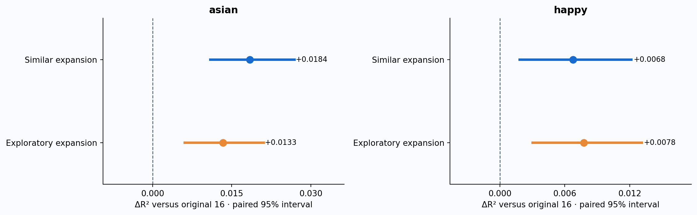
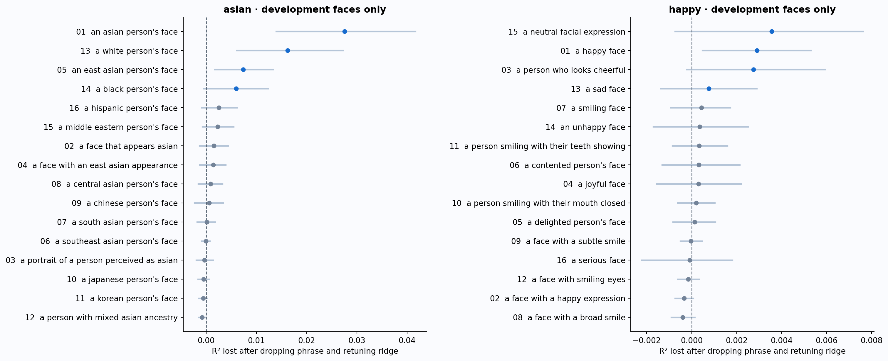
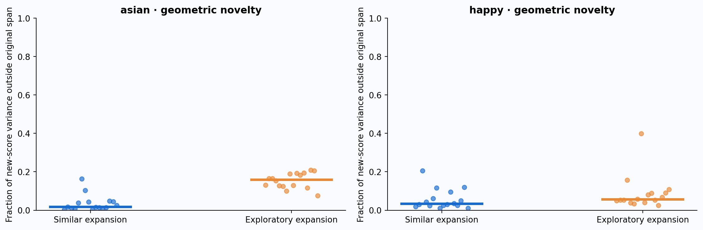
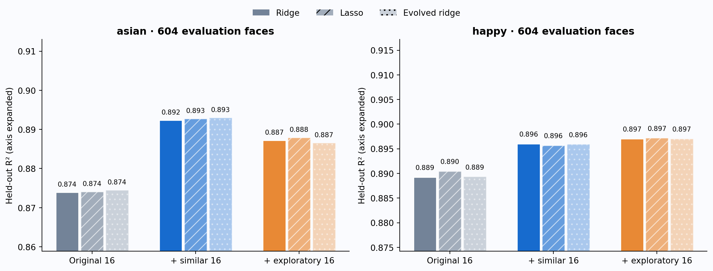
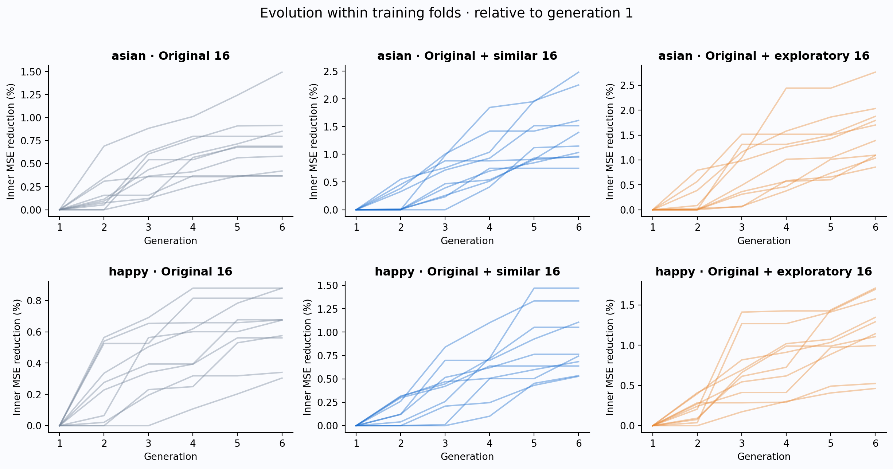
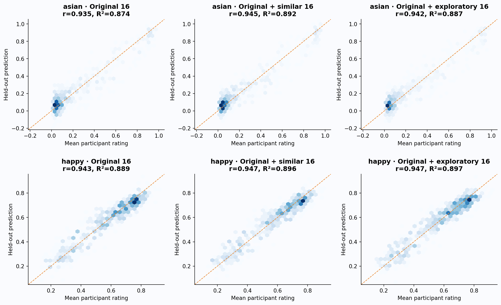

# So400m: exploitative versus exploratory prompt expansion

Frozen FG-CLIP 2 So400m, float16 on MPS, short text head, 128 image patches; 1,004 generated faces. Targets are mean subjective participant ratings of perceived Asian appearance and happiness. The experiment does not estimate objective ethnicity or internal emotional state.

## Result

| Attribute | Phrase space | Ridge r | Ridge R² | RMSE | ΔR² vs original | 95% paired interval |
|---|---|---:|---:|---:|---:|---|
| asian | original16 | 0.9349 | 0.8739 | 0.0973 | +0.0000 | — |
| asian | similar32 | 0.9446 | 0.8923 | 0.0900 | +0.0184 | [+0.0109, +0.0269] |
| asian | exploratory32 | 0.9419 | 0.8872 | 0.0921 | +0.0133 | [+0.0061, +0.0210] |
| happy | original16 | 0.9430 | 0.8893 | 0.0626 | +0.0000 | — |
| happy | similar32 | 0.9466 | 0.8960 | 0.0606 | +0.0068 | [+0.0018, +0.0122] |
| happy | exploratory32 | 0.9471 | 0.8970 | 0.0603 | +0.0078 | [+0.0030, +0.0131] |

**asian:** similar phrases reduce RMSE by 7.6%; exploratory phrases by 5.4%. The direct exploratory-minus-similar ΔR² is -0.0051, with interval [-0.0132, +0.0024]. The direct interval does not resolve a difference between the two expansions.

**happy:** similar phrases reduce RMSE by 3.1%; exploratory phrases by 3.6%. The direct exploratory-minus-similar ΔR² is +0.0010, with interval [-0.0045, +0.0068]. The direct interval does not resolve a difference between the two expansions.


Primary results use **604 evaluation faces**, each predicted once in outer CV. The 400 development faces used to choose parent phrases are included in training but excluded from these metrics. All three banks have identical train/test faces. Intervals resample paired fixed OOF predictions; they omit refit uncertainty, participant clustering and uncertainty in the phrase-development procedure. They are descriptive, unadjusted for multiple comparisons.



## What the larger model reproduces

The following original-16 results use ordinary 10×5 nested CV on all 1,004 faces, matching the earlier Base evaluation design.

| Attribute | Reference linear r | Reference isotonic R² | Original-16 ridge r | Original-16 ridge R² |
|---|---:|---:|---:|---:|
| asian | 0.8606 | 0.7873 | 0.9377 | 0.8793 |
| happy | 0.6529 | 0.4582 | 0.9428 | 0.8889 |

Previous Base original-16 ridge R² for asian: 0.8636; So400m: 0.8793. This architecture comparison is exploratory; no architecture was chosen using evaluation scores in the new phrase-development step.

Previous Base original-16 ridge R² for happy: 0.8902; So400m: 0.8889. This architecture comparison is exploratory; no architecture was chosen using evaluation scores in the new phrase-development step.


The reference “a happy face” should be checked against these exact settings rather than assumed to reproduce the previously reported r > 0.75. Reference linear r above is OOF-calibrated; raw-score r is recorded below.

## Which original phrases contribute?

On 400 fixed development faces, each original phrase was removed in turn, and ridge was refitted with its alpha retuned inside five inner folds. The reported loss is full-model OOF R² minus drop-one OOF R². Positive values indicate conditional predictive benefit. Ten outer folds cover all development faces. Single-phrase performance and adding a phrase to the reference were also measured.

Coefficient magnitude is not used as importance: correlated captions can substitute for one another. The top four conditional contributors define four parents, each producing four close lexical mutations. Importance intervals often overlap, particularly for happiness; the ordering is a search heuristic.



### asian: development ranking

| ID | Phrase | Drop-one ΔR² | Single calibrated r | Added-to-reference ΔR² |
|---:|---|---:|---:|---:|
| 1 | an asian person's face | +0.0276 | 0.8624 | +0.0000 |
| 13 | a white person's face | +0.0162 | 0.4125 | +0.0903 |
| 5 | an east asian person's face | +0.0074 | 0.8315 | +0.0083 |
| 14 | a black person's face | +0.0060 | 0.3350 | +0.0309 |
| 16 | a hispanic person's face | +0.0026 | 0.3832 | +0.0399 |
| 15 | a middle eastern person's face | +0.0023 | 0.1806 | +0.0419 |
| 2 | a face that appears asian | +0.0016 | 0.7890 | +0.0210 |
| 4 | a face with an east asian appearance | +0.0014 | 0.7577 | +0.0289 |
| 8 | a central asian person's face | +0.0009 | 0.4785 | +0.0389 |
| 9 | a chinese person's face | +0.0006 | 0.7686 | +0.0121 |
| 7 | a south asian person's face | +0.0001 | 0.6508 | +0.0065 |
| 6 | a southeast asian person's face | -0.0000 | 0.8424 | -0.0020 |
| 3 | a portrait of a person perceived as asian | -0.0003 | 0.7954 | +0.0092 |
| 10 | a japanese person's face | -0.0005 | 0.7549 | +0.0107 |
| 11 | a korean person's face | -0.0006 | 0.7913 | +0.0092 |
| 12 | a person with mixed asian ancestry | -0.0008 | 0.7793 | +0.0182 |
### happy: development ranking

| ID | Phrase | Drop-one ΔR² | Single calibrated r | Added-to-reference ΔR² |
|---:|---|---:|---:|---:|
| 15 | a neutral facial expression | +0.0036 | 0.3288 | +0.3371 |
| 1 | a happy face | +0.0029 | 0.6717 | +0.0000 |
| 3 | a person who looks cheerful | +0.0027 | 0.5514 | +0.0024 |
| 13 | a sad face | +0.0008 | 0.5685 | +0.3953 |
| 7 | a smiling face | +0.0004 | 0.7325 | +0.1056 |
| 14 | an unhappy face | +0.0004 | 0.4779 | +0.3538 |
| 11 | a person smiling with their teeth showing | +0.0003 | 0.8139 | +0.2245 |
| 6 | a contented person's face | +0.0003 | 0.3609 | +0.0164 |
| 4 | a joyful face | +0.0003 | 0.6507 | -0.0009 |
| 10 | a person smiling with their mouth closed | +0.0002 | 0.7484 | +0.1500 |
| 5 | a delighted person's face | +0.0001 | 0.6024 | +0.0002 |
| 9 | a face with a subtle smile | -0.0000 | 0.0231 | +0.2125 |
| 16 | a serious face | -0.0001 | 0.6496 | +0.4051 |
| 12 | a face with smiling eyes | -0.0001 | 0.4876 | +0.0650 |
| 2 | a face with a happy expression | -0.0003 | 0.4146 | +0.1547 |
| 8 | a face with a broad smile | -0.0004 | 0.5500 | +0.0286 |

## Two mutation strategies

**Similar:** four close variants for each of the top four original contributors. **Exploratory:** preserve short face-description syntax but introduce different visible-feature hypotheses. The latter is designed for semantic coverage, not claimed to be a mathematically maximal-diversity set. Contrasting and neutral descriptions are useful candidate regressors even when their standalone correlation is weak.

The 48-column cache contains original IDs 1–16, similar IDs 17–32, exploratory IDs 33–48. Comparisons use columns 1–32 or 1–16 plus 33–48; the two additions are never merged into a 48-feature predictor.

### asian: the 32 new phrases

Four close lexical/context variants for each of the four largest development drop-one contributions: Asian, White, East Asian, and Black face prompts. Contrasting appearance descriptions can explain residual variation without asserting objective ethnicity.

Keep short face-description syntax but replace category synonyms with separate visible-feature hypotheses spanning eyelids, eye shape/spacing, nose geometry, cheekbones, outline, jaw, lips, hair texture, facial hair, iris color and skin tones. These are candidate score directions, not diagnostic criteria for ethnicity. Diversity is intentional, not a proven mathematical maximum.

| New slot | Similar phrase (ID 16 + slot) | Exploratory phrase (ID 32 + slot) |
|---:|---|---|
| 1 | the face of an asian person | a face with a visible fold at the inner corners of the eyes |
| 2 | a close-up of an asian person's face | a face with upper eyelids without a visible crease |
| 3 | a portrait showing an asian person's face | a face with narrow almond-shaped eyes |
| 4 | an asian person's facial appearance | a face with widely spaced eyes |
| 5 | the face of a white person | a face with a low nose bridge |
| 6 | a close-up of a white person's face | a face with a wide nose |
| 7 | a portrait showing a white person's face | a face with high prominent cheekbones |
| 8 | a white person's facial appearance | a face with a round outline |
| 9 | the face of an east asian person | a face with a broad jaw |
| 10 | a close-up of an east asian person's face | a face with full lips |
| 11 | a portrait showing an east asian person's face | a face with straight black hair |
| 12 | an east asian person's facial appearance | a face with sparse facial hair |
| 13 | the face of a black person | a face with very dark brown eyes |
| 14 | a close-up of a black person's face | a face with pale skin |
| 15 | a portrait showing a black person's face | a face with warm golden skin tones |
| 16 | a black person's facial appearance | a face with deep brown skin |
### happy: the 32 new phrases

Four close variants for each of the four largest development drop-one contributions: neutral expression, happy face, cheerful-looking person, and sad face. Most ranks have overlapping uncertainty; the top four are an explicit mutation heuristic, not a claim of a definitive ordering.

Preserve short face/expression descriptions while exploring distinct visible components of expression: mouth corners, cheek elevation, eye wrinkles/aperture, brows, teeth, mouth opening, lip compression, dimples, asymmetry, jaw tension, tears and nasolabial folds. Include conflicting and subtle cues for regression to combine.

| New slot | Similar phrase (ID 16 + slot) | Exploratory phrase (ID 32 + slot) |
|---:|---|---|
| 1 | a face with a neutral expression | a face with the corners of the mouth turned upward |
| 2 | a person with a neutral facial expression | a face with the corners of the mouth turned downward |
| 3 | a portrait showing a neutral facial expression | a face with raised cheeks |
| 4 | an emotionally neutral face | a face with wrinkles beside the outer corners of the eyes |
| 5 | the face of a happy person | a face with narrowed eyes |
| 6 | a close-up of a happy face | a face with wide open eyes |
| 7 | a portrait showing a happy face | a face with relaxed eyebrows |
| 8 | a happy-looking face | a face with knitted eyebrows |
| 9 | a cheerful-looking person | a face with visible teeth |
| 10 | the face of a person who looks cheerful | a face with an open mouth |
| 11 | a portrait of a person who looks cheerful | a face with tightly pressed lips |
| 12 | a person with a cheerful appearance | a face with dimples |
| 13 | the face of a sad person | a face with a smile stronger on one side |
| 14 | a close-up of a sad face | a face with a tense jaw |
| 15 | a portrait showing a sad face | a face with visible tears |
| 16 | a sad-looking face | a face with deep folds from the nose to the corners of the mouth |



Novelty is measured on development images without ratings: standardize score columns, regress each new column on the original 16 scores, and measure residual variance. Greater novelty alone does not establish usefulness. This is an in-development geometric diagnostic, not a held-out effect.

## Ridge, lasso and evolutionary selection



| Attribute | Model | r | R² | RMSE | MAE |
|---|---|---:|---:|---:|---:|
| asian | reference_linear | 0.8586 | 0.7371 | 0.1406 | 0.1112 |
| asian | reference_isotonic | 0.8860 | 0.7848 | 0.1272 | 0.0898 |
| asian | original16/ridge | 0.9349 | 0.8739 | 0.0973 | 0.0743 |
| asian | original16/lasso | 0.9349 | 0.8741 | 0.0973 | 0.0743 |
| asian | original16/evolved_ridge | 0.9352 | 0.8745 | 0.0971 | 0.0742 |
| asian | similar32/ridge | 0.9446 | 0.8923 | 0.0900 | 0.0682 |
| asian | similar32/lasso | 0.9448 | 0.8927 | 0.0898 | 0.0680 |
| asian | similar32/evolved_ridge | 0.9450 | 0.8930 | 0.0897 | 0.0679 |
| asian | exploratory32/ridge | 0.9419 | 0.8872 | 0.0921 | 0.0697 |
| asian | exploratory32/lasso | 0.9423 | 0.8879 | 0.0918 | 0.0698 |
| asian | exploratory32/evolved_ridge | 0.9416 | 0.8866 | 0.0923 | 0.0700 |
| happy | reference_linear | 0.6383 | 0.4064 | 0.1448 | 0.1200 |
| happy | reference_isotonic | 0.6625 | 0.4360 | 0.1412 | 0.1150 |
| happy | original16/ridge | 0.9430 | 0.8893 | 0.0626 | 0.0493 |
| happy | original16/lasso | 0.9437 | 0.8904 | 0.0622 | 0.0490 |
| happy | original16/evolved_ridge | 0.9431 | 0.8893 | 0.0625 | 0.0492 |
| happy | similar32/ridge | 0.9466 | 0.8960 | 0.0606 | 0.0480 |
| happy | similar32/lasso | 0.9464 | 0.8957 | 0.0607 | 0.0480 |
| happy | similar32/evolved_ridge | 0.9465 | 0.8959 | 0.0606 | 0.0480 |
| happy | exploratory32/ridge | 0.9471 | 0.8970 | 0.0603 | 0.0477 |
| happy | exploratory32/lasso | 0.9472 | 0.8972 | 0.0603 | 0.0476 |
| happy | exploratory32/evolved_ridge | 0.9471 | 0.8971 | 0.0603 | 0.0475 |

The evolutionary searches provide no consistent additional gain over full-bank ridge. Treat the full 32-phrase ridge models as the simpler candidates for the next validation round; the small readout differences above do not establish a universal winner.


Evolution uses elitism, crossover and bit flips, with population 32, eight elites and six generations. Each expanded search starts with the full bank, the original-16 parent subset, and the reference-only subset plus random candidates. Phrase 1 is always retained. Subset and ridge alpha are selected jointly using training-only inner CV. The same search budget is used for all banks; this is a budgeted search rather than exhaustive optimization.





## Exploratory full-dataset comparison

For continuity with the earlier report, this table evaluates all 1,004 faces with ordinary nested CV. New wording was chosen using 400 of those faces, so the expanded-bank rows do **not** fully separate phrase development from evaluation. Use the 604-face comparison above for assessing this iteration’s incremental gains.

| Attribute | Space / readout | Pearson r | R² | RMSE |
|---|---|---:|---:|---:|
| asian | original16/ridge | 0.9377 | 0.8793 | 0.0974 |
| asian | similar32/ridge | 0.9479 | 0.8984 | 0.0894 |
| asian | exploratory32/ridge | 0.9445 | 0.8921 | 0.0921 |
| happy | original16/ridge | 0.9428 | 0.8889 | 0.0627 |
| happy | similar32/ridge | 0.9466 | 0.8961 | 0.0606 |
| happy | exploratory32/ridge | 0.9464 | 0.8958 | 0.0607 |

## Protocol and limitations

Development split seed: 20260909; model-CV seed: 20260908. The discovery split was written before inspecting So400m contributions. Both new banks were fixed before expanded-score evaluation. Primary outer training sets contain 943–944 faces (400 development plus evaluation-training faces); inner CV tunes on those training sets only. Each of the 604 evaluation faces is absent from its own model’s training and from this iteration’s phrase-ranking step. All faces had appeared in the previous Base experiment, so this is an exploratory research iteration, not an untouched external test.

Ridge uses 15 log-spaced alphas from 0.001 to 10,000; lasso uses 17 log-spaced fractions from 0.0001 to 1 of training alpha_max. Regressions use float64; encoding uses float16. No target clipping or cross-phrase softmax is applied. Targets retain original slider units; faces receive equal weight. Fold assignment is by face; participant identities and latent-family groups are unavailable. The implementation supports grouping in the original CV API, but this iteration does not estimate generalization to new latent families, raters or real photographs.

A gain from additional scores is evidence for a useful linear direction within this frozen encoder, not proof that the text names the visual mechanism causing human judgments. Eyelid, skin, hair and expression descriptions are hypotheses, not objective demographic or emotional labels.

- **asian:** raw reference r=0.8610; primary full comparison CV=5.07s; all-face comparison CV=4.98s (encoding, bootstrap and reporting excluded).
  Median new-score residual variance outside the original span: 1.6% for similar phrases versus 15.9% for exploratory phrases.
- **happy:** raw reference r=0.6541; primary full comparison CV=2.64s; all-face comparison CV=2.59s (encoding, bootstrap and reporting excluded).
  Median new-score residual variance outside the original span: 3.3% for similar phrases versus 5.6% for exploratory phrases.

## Reproduction and reusable code

All new functions live in `CLIP/fgclip2_face_impressions.py`: `phrase_contributions`, `development_protocol`, `anchored_cv_splits`, `compare_prompt_spaces`, `prompt_space_geometry`, feature extraction, exports and report generation. `expansion_prompts.json` supplies replaceable banks. Portable full-data fitted models are saved separately; their fitted predictions are never used for reported accuracy.

```bash
/opt/anaconda3/envs/manip311/bin/python -m CLIP.fgclip2_face_impressions encode --models so400m --output CLIP/research/so400m_prompt_expansion
/opt/anaconda3/envs/manip311/bin/python -m CLIP.fgclip2_face_impressions discover --output CLIP/research/so400m_prompt_expansion
# Freeze expansion_prompts.json using discovery results only.
/opt/anaconda3/envs/manip311/bin/python -m CLIP.fgclip2_face_impressions expand-encode --output CLIP/research/so400m_prompt_expansion
/opt/anaconda3/envs/manip311/bin/python -m CLIP.fgclip2_face_impressions compare --output CLIP/research/so400m_prompt_expansion
```

Exports include all OOF rows, exact folds, fitted fold models, search traces, bootstrap intervals, discovery rankings, phrase provenance, model revision and input/source hashes. Images are reused through the frozen feature cache.

Method references: [FG-CLIP official repository](https://github.com/360CVGroup/FG-CLIP); [nested CV documentation](https://scikit-learn.org/stable/auto_examples/model_selection/plot_nested_cross_validation_iris.html).
