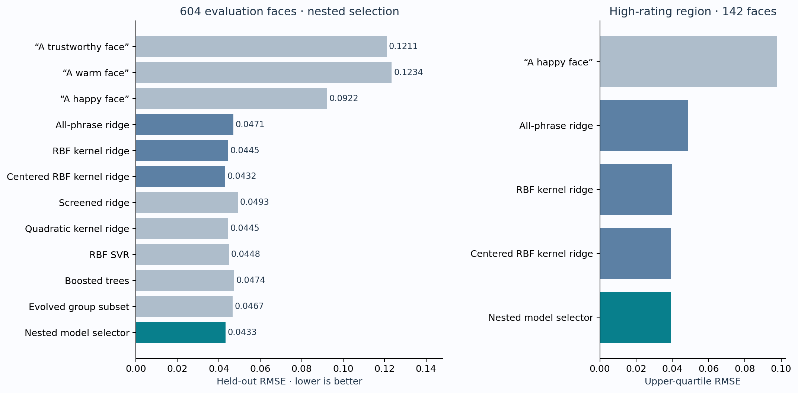
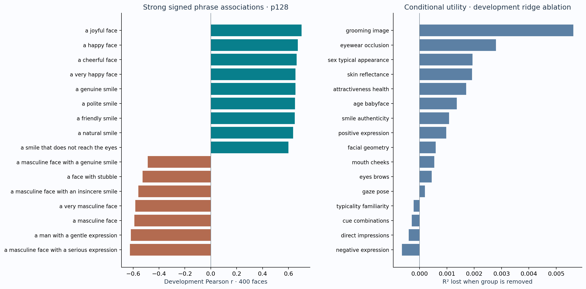
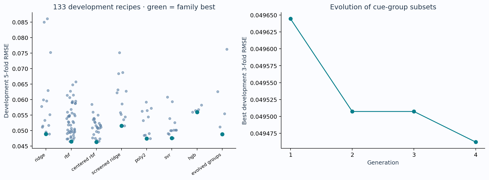
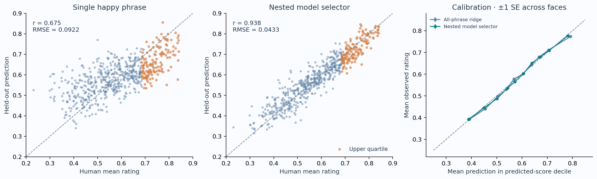
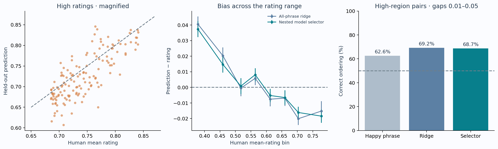

# Predicting perceived trustworthiness from a frozen vision–language model

**FG-CLIP2 So400m · 256 literature-guided phrases · nested evaluation · 8 September 2026**

The complete model-selection procedure reaches **r = 0.9380, R² = 0.8795, RMSE = 0.0433 and MAE = 0.0339** on 604 faces excluded from phrase exploration. The target is the mean human impression on the stored slider scale, not a person’s actual honesty or behavior. The final deployable model is refitted on all 1,004 original faces; its own training fit is never reported as accuracy.

Compared with all-phrase ridge, the nested selector changes RMSE by -0.0038. A paired face bootstrap gives a 95% interval of [0.0020, 0.0055] for RMSE reduction. This interval conditions on the fitted folds; it does not include retraining or search uncertainty.



## What the psychological literature suggested

The search connects findings about expression resemblance, smile components, facial form, typicality and image conditions. This is a targeted review of 14 primary studies/reviews, not an exhaustive systematic review. Each phrase group records its source links and whether its specific wording is exploratory. No individual caption is assumed to isolate a psychological mechanism.

| Evidence | Finding and implication |
|---|---|
| [Oosterhof & Todorov (2008), The functional basis of face evaluation](https://pmc.ncbi.nlm.nih.gov/articles/PMC2516255/) | Behavioral studies and a generative face-shape model relate perceived trustworthiness to approach/avoidance valence and resemblance to happy versus angry expressions; dominance is a distinct dimension. **Feature design:** Positive/negative affect, brows, mouth curvature, strength and combined cues. These concern impressions, not actual honesty. |
| [Vernon et al. (2014), Modeling first impressions from highly variable facial images](https://pmc.ncbi.nlm.nih.gov/articles/PMC4136614/) | A model using measured facial attributes predicted a substantial portion of variation in impressions of ambient photographs, including approachability; image properties as well as face structure matter. **Feature design:** Mouth, eye, shape, pose and image-condition descriptions; do not treat one expression-independent adjective as sufficient. |
| [Gunnery & Ruben (2016), Perceptions of Duchenne and non-Duchenne smiles: A meta-analysis](https://pubmed.ncbi.nlm.nih.gov/25787714/) | Duchenne smiles were evaluated more positively overall, including authenticity and trustworthiness; effects depended on stimulus and methodological differences. **Feature design:** Cheek raising, eye wrinkles, genuine versus posed or insincere smiles. A visual marker does not prove actual sincerity. |
| [Korb et al. (2014), The Perception and Mimicry of Facial Movements Predict Judgments of Smile Authenticity](https://pmc.ncbi.nlm.nih.gov/articles/PMC4053432/) | Perceived authenticity depends on multiple facial actions and their dynamics, rather than a single static cue. **Feature design:** Conflicting eye/mouth expressions and smile qualifiers; motion-related conclusions cannot be tested directly in static faces. |
| [Helwig et al. (2017), Dynamic properties of successful smiles](https://pmc.ncbi.nlm.nih.gov/articles/PMC5489184/) | Judgments of effective, genuine and pleasant smiles depended on combinations of mouth angle, extent, dental show and timing. This is adjacent evidence, not a direct trustworthiness-rating experiment. **Feature design:** Dental show, mouth opening, asymmetry and explicit combinations; nonlinear rather than monotonic smile intensity hypotheses. |
| [Sofer et al. (2015), What is typical is good](https://pubmed.ncbi.nlm.nih.gov/25512052/) | Along a controlled typicality-attractiveness continuum, trustworthiness peaked around the typical face while attractiveness increased further. **Feature design:** Typical, familiar, distinctive and highly attractive captions; smooth nonlinear models and interaction terms. |
| [The Nonlinear and Gender-Related Relationships of Face Attractiveness and Typicality With Perceived Trustworthiness (2021)](https://pmc.ncbi.nlm.nih.gov/articles/PMC8316726/) | This study modeled nonlinear relationships between typicality, attractiveness and trustworthiness and examined differences by gender. **Feature design:** Separate attractiveness, typicality and feminine/masculine appearance cues; allow their effects to interact rather than impose fixed signs. |
| [Graham & Ritchie (2019), Making a Spectacle of Yourself](https://pubmed.ncbi.nlm.nih.gov/31006340/) | In their experiment sunglasses reduced perceived trustworthiness. Clear glasses and sunglasses should not be treated as equivalent occlusions. **Feature design:** Glasses, sunglasses, transparent or dark lenses, visible versus hidden eyes, smiling with eyewear. |
| [Impact of face masks and sunglasses on attractiveness, trustworthiness, and familiarity, and limited time effect: a Japanese sample (2023)](https://pmc.ncbi.nlm.nih.gov/articles/PMC9872742/) | Occlusion and base attractiveness interacted in evaluations in a Japanese sample; eye and mouth coverage have different informational and cultural implications. **Feature design:** Occlusion by hair, eyewear and shadows; these experimental and cultural effects are not universal causal coefficients. |
| [Sutherland et al. (2017), Facial first impressions from another angle](https://bpspsychub.onlinelibrary.wiley.com/doi/10.1111/bjop.12206) | Expression and viewpoint affected impressions, with substantial within-person image variability. **Feature design:** Pose and expression conjunctions; random-face validation cannot establish accuracy on same-identity latent neighbors. |
| [Witkower & Tracy (2019), A Facial-Action Imposter](https://pubmed.ncbi.nlm.nih.gov/31009583/) | Downward head tilt increased perceived dominance in their studies through apparent lowered, V-shaped brows. This is evidence about dominance, not a direct universal effect on trust. **Feature design:** Head tilt, lowered brows and dominance interactions as exploratory predictors. |
| [Todorov & Porter (2014), Misleading first impressions](https://pubmed.ncbi.nlm.nih.gov/24866921/) | Different photographs of the same person produced substantially different first impressions, and image preferences depended on context. **Feature design:** Image quality, lighting, view and expression controls; hidden same-person comparisons remain a distinct validation problem. |
| [Todorov et al. (2025), Face evaluation: Findings, methods, and challenges](https://pmc.ncbi.nlm.nih.gov/articles/PMC11918531/) | This review describes contributions from expression resemblance, feminine and baby-faced appearance, shape and reflectance, and substantial perceiver-specific variance in complex judgments. **Feature design:** Age, facial maturity, sex-typical appearance, skin reflectance and geometry; interpret group mean prediction without claiming objective personality. |
| [Sofer et al. (2017), For Your Local Eyes Only](https://journals.sagepub.com/doi/abs/10.1177/0301006617691786) | The paper examines culture-specific typicality in perceived trustworthiness. **Feature design:** Typicality and familiarity may be observer dependent; the model targets this participant sample rather than universal trust judgments. |

## From literature to a nonlinear predictor

The frozen bank contains 16 groups of 16 phrases: direct impressions, positive expressions, smile authenticity, negative expressions, mouth/cheeks, eyes/brows, gaze/pose, sex-typical appearance, age/babyface, facial geometry, typicality/familiarity, attractiveness/health appearance, skin reflectance, grooming/image conditions, eyewear/occlusion, and explicit cue combinations. Some are established broad cue families; granular wording and interaction captions are model hypotheses.

So400m encodes every image with patch budgets 128 and 256, producing 512 image–text similarity logits. The image/text encoder is frozen and runs in float16; regression calculations use float64. Scores are not probabilities. The raw-score models standardize each column using training data only. Centered RBF first subtracts each image’s mean score separately within each resolution, then applies training-column standardization.

Linear ridge and screened/evolved subsets compete with smooth RBF kernel ridge, a quadratic kernel, RBF support-vector regression and boosted trees. The RBF kernel uses exp(−γ‖z−z′‖²), with γ equal to the recipe gamma divided by its feature count. It can represent nonlinear cue combinations without explicitly estimating all pairwise coefficients. The quadratic kernel is (1 + z·z′/p)². Convex blends of the three best inner-CV families are also considered. MSE governs every selection; correlation and pair ordering are diagnostics.

## Phrase exploration: useful signals and misleading wording



| Phrase | Development r, p128 | Development r, p256 |
|---|---:|---:|
| a trustworthy face | 0.2966 | 0.1138 |
| a warm face | 0.2529 | 0.1539 |
| a happy face | 0.6727 | 0.5846 |
| a joyful face | 0.7010 | 0.6283 |
| a genuine smile | 0.6539 | 0.5675 |
| an insincere smile | 0.5222 | 0.4048 |
| a very feminine face | 0.3446 | 0.2974 |
| glasses | -0.0481 | -0.1327 |
| sunglasses | -0.0468 | -0.1348 |

“An insincere smile” has a positive marginal association. One possible explanation is that the encoder emphasizes smiling content over the modifier; the correlation alone cannot establish that mechanism. Negatively worded captions should therefore enter as measured features, rather than being assigned a negative sign by hand. The eye/mouth and eyewear combinations similarly remain hypotheses.

The ablation plot removes both resolutions of a cue group and refits development CV ridge using a fixed, development-selected alpha. Positive values indicate conditional predictive utility in that readout, not causal importance. Strongly correlated phrases can substitute for one another. The complete 512-row table includes Pearson, Spearman, p and Benjamini–Hochberg q values; these are exploratory, face-independence-based statistics and do not measure incremental utility in the nonlinear model.



Evolution searched group masks using a population of 12, three elites, crossover, bit-flip mutation and four generations. Three-fold development CV tuned each mask over ridge alphas 10, 100 and 1000. The best mask was then evaluated with five ridge alphas in the larger development comparison. This budgeted search tests whether dropping cue families helps; it is not exhaustive optimization. The full bank remains eligible.

## Evaluation protocol and complete results

A fixed seed (20260910) separates 400 development faces from 604 evaluation faces. All phrase statistics, group evolution and initial recipe pruning use the development faces only. The best two development recipes from each of eight model families form a frozen list of 16. Each of ten outer folds trains on the 400 development faces plus the other evaluation faces (943–944 training faces). Five-fold inner CV selects each family’s recipe and the final recipe/blend. Every evaluation face is predicted once by a model that has not seen its rating. Baseline single phrases receive training-only linear slope/intercept calibration.

This is complete ten-fold coverage of the development-excluded faces, not leave-one-out CV and not an external test. The 400 development faces are deliberately excluded from headline accuracy. Earlier research used these original images for other attributes; this evaluation does not establish independence from prior image-level familiarity.

| Readout / procedure | Pearson r | Spearman ρ | R² | RMSE | MAE |
|---|---:|---:|---:|---:|---:|
| Training mean | -0.1176 | -0.1150 | -0.0056 | 0.1252 | 0.1044 |
| “A trustworthy face” | 0.2505 | 0.2487 | 0.0592 | 0.1211 | 0.1008 |
| “A warm face” | 0.1648 | 0.1696 | 0.0221 | 0.1234 | 0.1031 |
| “A happy face” | 0.6749 | 0.6674 | 0.4542 | 0.0922 | 0.0736 |
| All-phrase ridge | 0.9263 | 0.9323 | 0.8577 | 0.0471 | 0.0367 |
| RBF kernel ridge | 0.9343 | 0.9394 | 0.8727 | 0.0445 | 0.0348 |
| Centered RBF kernel ridge | 0.9387 | 0.9411 | 0.8805 | 0.0432 | 0.0341 |
| Screened ridge | 0.9191 | 0.9242 | 0.8443 | 0.0493 | 0.0385 |
| Quadratic kernel ridge | 0.9347 | 0.9385 | 0.8731 | 0.0445 | 0.0346 |
| RBF SVR | 0.9338 | 0.9389 | 0.8710 | 0.0448 | 0.0352 |
| Boosted trees | 0.9263 | 0.9288 | 0.8557 | 0.0474 | 0.0372 |
| Evolved group subset | 0.9274 | 0.9328 | 0.8598 | 0.0467 | 0.0365 |
| Nested model selector | 0.9380 | 0.9414 | 0.8795 | 0.0433 | 0.0339 |

The “Nested model selector” row is the prespecified primary procedure. Picking the best family after reading this table would introduce additional selection optimism. Family comparisons are useful diagnostics, but do not override the frozen selection rule. Centered RBF has a slightly better standalone outer score; the final model still follows the declared inner-CV selection rule.



Calibration bins are defined by held-out predictions. Error bars are ±1 standard error across faces, not uncertainty intervals for an individual rating or the whole training procedure.

## Fine differences at high ratings

The upper region uses the 75th percentile of the corresponding outer training ratings as its threshold (142 evaluation faces). The selector has high-region **RMSE 0.0390, MAE 0.0312, r 0.7841, R² 0.2069**. Restricting the range makes this a harder and distinct assessment.



| Procedure | High-region RMSE | High-region MAE | Close-pair ordering | Pairs | Noise-separated pairs | Ordering on noise-separated pairs |
|---|---:|---:|---:|---:|---:|---:|
| “A happy face” | 0.0977 | 0.0840 | 62.6% | 438 | 3 | 100.0% |
| All-phrase ridge | 0.0488 | 0.0378 | 69.2% | 438 | 3 | 100.0% |
| RBF kernel ridge | 0.0399 | 0.0319 | 68.9% | 438 | 3 | 100.0% |
| Centered RBF kernel ridge | 0.0392 | 0.0315 | 67.8% | 438 | 3 | 100.0% |
| Nested model selector | 0.0390 | 0.0312 | 68.7% | 438 | 3 | 100.0% |

Close pairs have human-mean gaps from 0.01 to 0.05, both faces in the upper region, and the same outer fold so their predictions come from the same fitted model. Ties receive half credit. The nonlinear selector improves high-region rating error but does not improve this close-pair ordering diagnostic over ridge. These are different images close in rating; they are **not verified same-identity latent variants**. Pairs reuse faces, so the pair count is not an independent sample size.

The median per-face rating SEM in evaluation is 0.0229. The optional “noise-separated” filter requires the observed gap to exceed 1.96√(SEM₁² + SEM₂²). It assumes independent rating errors and omits shared-rater covariance; it is an approximate descriptive screen. The remaining pairs can be very few. A good population-level score does not establish sensitivity to arbitrarily small changes among extremely trustworthy-looking variants. Your hidden controlled test is necessary for that claim.

## Frozen model for the hidden test

All 1,004 original faces are used for final five-fold recipe/blend selection and refitting. This follows the same frozen candidate list and MSE rule, without choosing a family from the outer-score table. Final components:

```json
{
  "recipes": [
    {
      "family": "centered_rbf",
      "bank": "both",
      "gamma": 0.1,
      "alpha": 0.1
    },
    {
      "family": "poly2",
      "bank": "p256",
      "alpha": 0.1
    }
  ],
  "weights": [
    0.5,
    0.5
  ]
}
```

The bundle stores fitted estimators, feature order, scaling, target mean, text bank, pinned encoder revision, resolution settings, versions and training image names. No target clipping is applied; predictions remain in stored slider units. The extra 1,560 study-stimulus rating records are excluded from model fitting and evaluation, and no hidden test images are scored in this experiment.

```python
from CLIP.fgclip2_face_impressions import TrustworthinessPredictor
model = TrustworthinessPredictor.load('/Users/adamsobieszek/PycharmProjects/psych_gen_app/CLIP/research/trustworthiness/trustworthiness_model.joblib')
means = model.predict_images(["/path/to/face_a.png", "/path/to/face_b.png"])
rating_difference = means[1] - means[0]
```

Run from the project root using `/opt/anaconda3/envs/manip311/bin/python`. Image inference loads the cached, pinned So400m model on MPS at half precision. The joblib bundle should be loaded only as a trusted artifact and with its recorded sklearn version. A folder command is documented in `INFERENCE.md`.

## Reproducibility and limits

- Original face set: 1,004 images; trustworthy ratings per face 69–108, median 86. Faces receive equal loss weight.
- Exact outer evaluation time: 81.9 seconds, excluding encoding, development, bootstrap and final fitting. One BLAS thread avoids small-matrix thread overhead.
- Split unit is the image. Exact duplicates are checked; unknown identity/latent-family relationships and shared raters are not modeled. Generalization to new identities, rater populations, photographic domains or controlled latent traversals requires separate tests.
- Literature-guided prompts can capture appearance stereotypes and image artifacts. A feature’s predictive contribution does not prove a visual cause of judgments, accurate demographic identification, or actual character.
- Hyperparameter and phrase searches were finite. The reported model is the result of this tested search, not a guarantee of globally maximal accuracy.
- `oof_predictions.csv` contains every evaluation prediction. `results.json` contains exact test indices, inner losses and fold selections. `exploration.json` retains all development recipes, correlations, group ablations and evolutionary traces. `model_manifest.json` records hashes and software versions; `evaluation_source.py.txt` snapshots evaluation code.
- Reusable functions for encoding, development, nested CV, tail metrics, fitting, inference and reporting are in `CLIP/fgclip2_face_impressions.py`. `CLIP/test_fgclip2_research.py` includes numerical parity, serialization, score-centering and held-out-label leakage tests.

### Fresh-image inference verification

```json
{
  "n_original_images": 7,
  "faces": [
    "638.jpg",
    "132.jpg",
    "382.jpg",
    "13.jpg",
    "865.jpg",
    "708.jpg",
    "336.jpg"
  ],
  "cached_feature_predictions": [
    0.2970195601438068,
    0.4464752553168114,
    0.4984009250259198,
    0.5685436090771379,
    0.6412713112165658,
    0.6823531211554801,
    0.8371110744057881
  ],
  "fresh_image_predictions": [
    0.2970195601438068,
    0.4464752553168114,
    0.4984009250259198,
    0.5685436090771379,
    0.6412713112165658,
    0.6823531211554801,
    0.8371110744057881
  ],
  "fresh_vs_cache_max_score_difference": 0.0,
  "fresh_vs_cache_max_prediction_difference": 0.0,
  "batch_1_vs_multi_max_prediction_difference": 1.9793053063210664e-07,
  "repeated_batch_max_prediction_difference": 0.0,
  "all_predictions_finite": true,
  "sklearn_version": "1.8.0",
  "hidden_images_used": false
}
```

## Complete phrase bank

The table below is the frozen, pre-evaluation bank. Source links describe the broad evidence; exact captions and combinations are exploratory probes.

### Direct impressions

baseline semantic probes; adjective wording is a model hypothesis. Sources: [Oosterhof & Todorov (2008), The functional basis of face evaluation](https://pmc.ncbi.nlm.nih.gov/articles/PMC2516255/).

| Phrase | r, p128 | r, p256 |
|---|---:|---:|
| a trustworthy face | 0.297 | 0.114 |
| a warm face | 0.253 | 0.154 |
| an untrustworthy face | -0.039 | -0.172 |
| an honest-looking face | -0.041 | -0.187 |
| a dishonest-looking face | -0.416 | -0.458 |
| a kind-looking face | 0.330 | 0.162 |
| a mean-looking face | -0.232 | -0.345 |
| a friendly face | 0.489 | 0.352 |
| an unfriendly face | -0.063 | -0.175 |
| an approachable face | 0.318 | 0.190 |
| an unapproachable face | -0.208 | -0.316 |
| a reassuring face | 0.213 | 0.028 |
| a threatening face | -0.228 | -0.347 |
| a sincere-looking face | 0.050 | -0.103 |
| a suspicious-looking face | -0.331 | -0.423 |
| a face that makes a positive first impression | 0.406 | 0.204 |

### Positive expression

expression resemblance. Sources: [Oosterhof & Todorov (2008), The functional basis of face evaluation](https://pmc.ncbi.nlm.nih.gov/articles/PMC2516255/), [Vernon et al. (2014), Modeling first impressions from highly variable facial images](https://pmc.ncbi.nlm.nih.gov/articles/PMC4136614/).

| Phrase | r, p128 | r, p256 |
|---|---:|---:|
| a happy face | 0.673 | 0.585 |
| a very happy face | 0.654 | 0.560 |
| a slightly happy face | 0.361 | 0.252 |
| a cheerful face | 0.663 | 0.579 |
| a joyful face | 0.701 | 0.628 |
| a contented face | 0.398 | 0.274 |
| a peaceful face | 0.281 | 0.160 |
| a relaxed face | 0.124 | 0.033 |
| a welcoming facial expression | 0.451 | 0.256 |
| an affectionate facial expression | 0.361 | 0.227 |
| a compassionate facial expression | 0.190 | 0.044 |
| a gentle facial expression | 0.323 | 0.221 |
| a calm neutral face | 0.103 | -0.025 |
| a delighted face | 0.599 | 0.492 |
| a friendly smile | 0.648 | 0.570 |
| a face with smiling eyes | 0.555 | 0.434 |

### Smile authenticity

perceived authenticity; static captions do not establish true intentions. Sources: [Gunnery & Ruben (2016), Perceptions of Duchenne and non-Duchenne smiles: A meta-analysis](https://pubmed.ncbi.nlm.nih.gov/25787714/), [Korb et al. (2014), The Perception and Mimicry of Facial Movements Predict Judgments of Smile Authenticity](https://pmc.ncbi.nlm.nih.gov/articles/PMC4053432/), [Helwig et al. (2017), Dynamic properties of successful smiles](https://pmc.ncbi.nlm.nih.gov/articles/PMC5489184/).

| Phrase | r, p128 | r, p256 |
|---|---:|---:|
| a genuine smile | 0.654 | 0.567 |
| an insincere smile | 0.522 | 0.405 |
| a sincere smile | 0.596 | 0.521 |
| a fake smile | 0.551 | 0.451 |
| a forced smile | 0.534 | 0.441 |
| a natural smile | 0.636 | 0.593 |
| a polite smile | 0.651 | 0.565 |
| a nervous smile | 0.545 | 0.404 |
| a smug smile | 0.509 | 0.390 |
| a sly smile | 0.572 | 0.482 |
| a contemptuous smirk | -0.058 | -0.219 |
| a spontaneous-looking smile | 0.557 | 0.444 |
| a smile that does not reach the eyes | 0.600 | 0.490 |
| a smile with relaxed eyes | 0.509 | 0.419 |
| a smile with tense eyes | 0.450 | 0.302 |
| an exaggerated smile | 0.534 | 0.428 |

### Negative expression

negative affect and expression contrasts. Sources: [Oosterhof & Todorov (2008), The functional basis of face evaluation](https://pmc.ncbi.nlm.nih.gov/articles/PMC2516255/), [Sutherland et al. (2017), Facial first impressions from another angle](https://bpspsychub.onlinelibrary.wiley.com/doi/10.1111/bjop.12206).

| Phrase | r, p128 | r, p256 |
|---|---:|---:|
| an angry face | -0.186 | -0.286 |
| a slightly angry face | -0.227 | -0.296 |
| a hostile facial expression | -0.390 | -0.448 |
| an aggressive facial expression | -0.238 | -0.342 |
| an annoyed face | -0.284 | -0.345 |
| an irritated face | -0.059 | -0.188 |
| a disgusted face | -0.145 | -0.204 |
| a contemptuous face | -0.133 | -0.281 |
| a sad face | -0.122 | -0.204 |
| an anxious face | 0.008 | -0.144 |
| a fearful face | -0.114 | -0.292 |
| a worried face | -0.162 | -0.278 |
| a bored face | -0.179 | -0.229 |
| a stern face | -0.453 | -0.543 |
| a serious face | -0.251 | -0.361 |
| a neutral facial expression | -0.006 | -0.110 |

### Mouth cheeks

visible smile components; granular variants are exploratory. Sources: [Gunnery & Ruben (2016), Perceptions of Duchenne and non-Duchenne smiles: A meta-analysis](https://pubmed.ncbi.nlm.nih.gov/25787714/), [Helwig et al. (2017), Dynamic properties of successful smiles](https://pmc.ncbi.nlm.nih.gov/articles/PMC5489184/), [Vernon et al. (2014), Modeling first impressions from highly variable facial images](https://pmc.ncbi.nlm.nih.gov/articles/PMC4136614/).

| Phrase | r, p128 | r, p256 |
|---|---:|---:|
| a face with upturned mouth corners | 0.108 | -0.045 |
| a face with downturned mouth corners | -0.014 | -0.147 |
| a face with a straight mouth | 0.156 | 0.009 |
| a face with a subtle smile | 0.303 | 0.184 |
| a face with a broad smile | 0.536 | 0.412 |
| a face with an open-mouth smile | 0.552 | 0.419 |
| a face with a closed-mouth smile | 0.331 | 0.198 |
| a face with upper teeth showing | 0.465 | 0.306 |
| a face with many teeth showing | 0.533 | 0.391 |
| a face with tightly pressed lips | -0.090 | -0.185 |
| a face with pursed lips | 0.004 | -0.113 |
| a face with relaxed lips | 0.091 | -0.027 |
| a face with raised cheeks | 0.131 | -0.028 |
| a face with dimples | 0.477 | 0.371 |
| a face with a one-sided smile | 0.350 | 0.187 |
| a face with deep smile lines | 0.316 | 0.175 |

### Eyes brows

visible expression components. Sources: [Oosterhof & Todorov (2008), The functional basis of face evaluation](https://pmc.ncbi.nlm.nih.gov/articles/PMC2516255/), [Gunnery & Ruben (2016), Perceptions of Duchenne and non-Duchenne smiles: A meta-analysis](https://pubmed.ncbi.nlm.nih.gov/25787714/), [Witkower & Tracy (2019), A Facial-Action Imposter](https://pubmed.ncbi.nlm.nih.gov/31009583/).

| Phrase | r, p128 | r, p256 |
|---|---:|---:|
| a face with wrinkles beside the outer corners of the eyes | 0.058 | -0.053 |
| a face with smooth outer eye corners | 0.137 | 0.033 |
| a face with narrowed eyes | 0.021 | -0.100 |
| a face with wide open eyes | 0.134 | -0.025 |
| a face with relaxed eyelids | 0.033 | -0.099 |
| a face with tense eyelids | -0.245 | -0.354 |
| a face with raised eyebrows | -0.032 | -0.199 |
| a face with lowered eyebrows | -0.066 | -0.186 |
| a face with knitted eyebrows | 0.193 | 0.032 |
| a face with relaxed eyebrows | 0.059 | -0.076 |
| a face with V-shaped eyebrows | 0.178 | 0.027 |
| a face with arched eyebrows | 0.200 | 0.053 |
| a face with raised inner eyebrows | -0.059 | -0.231 |
| a face with lowered inner eyebrows | -0.073 | -0.204 |
| a face with heavy eyelids | -0.159 | -0.259 |
| a face with bright alert eyes | 0.135 | -0.062 |

### Gaze pose

view and expression integration; gaze variants are exploratory. Sources: [Sutherland et al. (2017), Facial first impressions from another angle](https://bpspsychub.onlinelibrary.wiley.com/doi/10.1111/bjop.12206), [Witkower & Tracy (2019), A Facial-Action Imposter](https://pubmed.ncbi.nlm.nih.gov/31009583/), [Todorov & Porter (2014), Misleading first impressions](https://pubmed.ncbi.nlm.nih.gov/24866921/).

| Phrase | r, p128 | r, p256 |
|---|---:|---:|
| a face looking directly at the viewer | 0.046 | -0.174 |
| a face looking away from the viewer | 0.005 | -0.233 |
| a face looking sideways | 0.041 | -0.180 |
| a face looking downward | -0.115 | -0.288 |
| a face looking upward | 0.117 | -0.134 |
| a face with a steady gaze | -0.028 | -0.209 |
| a face with a piercing stare | -0.120 | -0.265 |
| a face with a soft gaze | 0.174 | 0.067 |
| a face with the head tilted downward | 0.053 | -0.132 |
| a face with the head tilted upward | 0.114 | -0.085 |
| a face with the head tilted to one side | 0.117 | -0.063 |
| a face looking over a shoulder | 0.039 | -0.181 |
| a front-facing portrait | 0.123 | -0.064 |
| a three-quarter view of a face | 0.075 | -0.117 |
| a face in profile | -0.043 | -0.285 |
| a face with the chin tucked down | 0.114 | -0.029 |

### Sex typical appearance

perceived sex-typical appearance; no ground-truth gender used. Sources: [Todorov et al. (2025), Face evaluation: Findings, methods, and challenges](https://pmc.ncbi.nlm.nih.gov/articles/PMC11918531/), [The Nonlinear and Gender-Related Relationships of Face Attractiveness and Typicality With Perceived Trustworthiness (2021)](https://pmc.ncbi.nlm.nih.gov/articles/PMC8316726/).

| Phrase | r, p128 | r, p256 |
|---|---:|---:|
| a very feminine face | 0.345 | 0.297 |
| a feminine face | 0.311 | 0.263 |
| a slightly feminine face | 0.303 | 0.255 |
| a masculine face | -0.590 | -0.591 |
| a very masculine face | -0.582 | -0.587 |
| an androgynous face | 0.144 | 0.048 |
| a face with soft delicate features | 0.209 | 0.113 |
| a face with rugged features | -0.182 | -0.270 |
| a face with a delicate jaw | 0.172 | 0.030 |
| a face with a strong square jaw | -0.107 | -0.219 |
| a face with a prominent brow ridge | 0.052 | -0.131 |
| a face with a smooth forehead | 0.075 | -0.055 |
| a woman with a gentle expression | 0.290 | 0.251 |
| a man with a gentle expression | -0.618 | -0.610 |
| a feminine face with a serious expression | 0.237 | 0.191 |
| a masculine face with a serious expression | -0.624 | -0.628 |

### Age babyface

facial maturity and baby-faced appearance hypotheses. Sources: [Todorov et al. (2025), Face evaluation: Findings, methods, and challenges](https://pmc.ncbi.nlm.nih.gov/articles/PMC11918531/).

| Phrase | r, p128 | r, p256 |
|---|---:|---:|
| a baby-faced adult | 0.446 | 0.382 |
| a mature-looking adult face | -0.103 | -0.182 |
| a youthful-looking face | 0.342 | 0.266 |
| an older-looking face | 0.034 | -0.150 |
| a middle-aged face | -0.416 | -0.500 |
| a face with childlike features | 0.451 | 0.370 |
| a face with large eyes and a small chin | 0.200 | 0.092 |
| a face with round full cheeks | 0.279 | 0.160 |
| a face with a small nose | 0.201 | 0.038 |
| a face with a short lower face | 0.141 | -0.007 |
| a face with a high rounded forehead | 0.034 | -0.127 |
| a face with visible wrinkles | 0.100 | -0.061 |
| a face with deep forehead lines | -0.139 | -0.309 |
| a face with sagging skin | 0.004 | -0.149 |
| an elderly person with a gentle face | 0.053 | -0.079 |
| a young adult with a stern face | -0.159 | -0.227 |

### Facial geometry

broad geometry basis; individual directions are exploratory. Sources: [Vernon et al. (2014), Modeling first impressions from highly variable facial images](https://pmc.ncbi.nlm.nih.gov/articles/PMC4136614/), [Oosterhof & Todorov (2008), The functional basis of face evaluation](https://pmc.ncbi.nlm.nih.gov/articles/PMC2516255/), [Todorov et al. (2025), Face evaluation: Findings, methods, and challenges](https://pmc.ncbi.nlm.nih.gov/articles/PMC11918531/).

| Phrase | r, p128 | r, p256 |
|---|---:|---:|
| a round face | 0.413 | 0.302 |
| a long narrow face | -0.054 | -0.195 |
| a broad face | 0.062 | -0.075 |
| an oval face | 0.201 | 0.056 |
| an angular face | -0.160 | -0.296 |
| a face with high cheekbones | -0.056 | -0.177 |
| a face with flat cheeks | 0.159 | 0.032 |
| a face with a small chin | 0.199 | 0.062 |
| a face with a prominent chin | 0.011 | -0.153 |
| a face with a broad nose | 0.041 | -0.134 |
| a face with a narrow nose | 0.081 | -0.077 |
| a face with thin lips | 0.182 | 0.081 |
| a face with full lips | 0.174 | 0.084 |
| a symmetrical face | 0.105 | -0.052 |
| an asymmetrical face | 0.093 | -0.094 |
| a face with widely spaced eyes | 0.001 | -0.163 |

### Typicality familiarity

typicality may be nonlinear and perceiver dependent. Sources: [Sofer et al. (2015), What is typical is good](https://pubmed.ncbi.nlm.nih.gov/25512052/), [The Nonlinear and Gender-Related Relationships of Face Attractiveness and Typicality With Perceived Trustworthiness (2021)](https://pmc.ncbi.nlm.nih.gov/articles/PMC8316726/), [Sofer et al. (2017), For Your Local Eyes Only](https://journals.sagepub.com/doi/abs/10.1177/0301006617691786).

| Phrase | r, p128 | r, p256 |
|---|---:|---:|
| a typical-looking face | -0.020 | -0.173 |
| an average-looking face | 0.093 | -0.033 |
| a familiar-looking face | 0.021 | -0.142 |
| an ordinary-looking face | 0.129 | -0.018 |
| a distinctive-looking face | -0.101 | -0.294 |
| an unusual-looking face | 0.014 | -0.172 |
| a memorable face | 0.229 | 0.044 |
| a face with balanced proportions | 0.037 | -0.128 |
| a face with exaggerated features | -0.127 | -0.261 |
| a face with unusual proportions | -0.034 | -0.197 |
| a natural-looking face | 0.281 | 0.218 |
| an artificial-looking face | -0.051 | -0.140 |
| a face that looks like someone you know | 0.101 | -0.053 |
| a face with conventional features | 0.058 | -0.084 |
| a face with striking features | -0.022 | -0.212 |
| a face with unremarkable features | 0.047 | -0.105 |

### Attractiveness health

halo and health appearance hypotheses, not medical judgments. Sources: [Sofer et al. (2015), What is typical is good](https://pubmed.ncbi.nlm.nih.gov/25512052/), [The Nonlinear and Gender-Related Relationships of Face Attractiveness and Typicality With Perceived Trustworthiness (2021)](https://pmc.ncbi.nlm.nih.gov/articles/PMC8316726/), [Todorov et al. (2025), Face evaluation: Findings, methods, and challenges](https://pmc.ncbi.nlm.nih.gov/articles/PMC11918531/).

| Phrase | r, p128 | r, p256 |
|---|---:|---:|
| an attractive face | -0.005 | -0.113 |
| a very attractive face | -0.084 | -0.195 |
| a plain-looking face | 0.096 | -0.020 |
| an unattractive face | -0.001 | -0.118 |
| a beautiful face | 0.365 | 0.293 |
| a handsome face | -0.427 | -0.447 |
| a cute face | 0.541 | 0.473 |
| a face with a healthy appearance | 0.373 | 0.264 |
| a face with a tired appearance | -0.096 | -0.201 |
| a face with a sickly appearance | 0.006 | -0.108 |
| a face with dark circles under the eyes | -0.059 | -0.192 |
| a face with puffy eyes | 0.103 | 0.013 |
| a face with a fresh appearance | 0.228 | 0.112 |
| a face with a lively expression | 0.336 | 0.163 |
| a face with a sleepy expression | 0.061 | -0.031 |
| a face with a well-rested appearance | 0.088 | -0.101 |

### Skin reflectance

texture/reflectance basis; these are visual cues rather than ethnicity labels. Sources: [Todorov et al. (2025), Face evaluation: Findings, methods, and challenges](https://pmc.ncbi.nlm.nih.gov/articles/PMC11918531/), [Vernon et al. (2014), Modeling first impressions from highly variable facial images](https://pmc.ncbi.nlm.nih.gov/articles/PMC4136614/).

| Phrase | r, p128 | r, p256 |
|---|---:|---:|
| a face with smooth skin | 0.164 | 0.065 |
| a face with rough skin texture | -0.061 | -0.172 |
| a face with clear skin | 0.194 | 0.076 |
| a face with uneven skin texture | 0.051 | -0.084 |
| a face with freckles | 0.304 | 0.189 |
| a face with visible facial blemishes | 0.052 | -0.122 |
| a face with a facial scar | -0.098 | -0.260 |
| a face with pale skin | 0.081 | -0.029 |
| a face with dark skin | 0.107 | -0.012 |
| a face with warm skin tones | 0.179 | 0.053 |
| a face with rosy cheeks | 0.429 | 0.356 |
| a face with dull skin tones | 0.046 | -0.067 |
| a face with shiny skin | 0.131 | 0.023 |
| a face with strong facial contrast | -0.017 | -0.172 |
| a face with low facial contrast | 0.093 | -0.035 |
| a face with evenly colored skin | 0.176 | 0.036 |

### Grooming image

exploratory appearance and nuisance controls. Sources: [Vernon et al. (2014), Modeling first impressions from highly variable facial images](https://pmc.ncbi.nlm.nih.gov/articles/PMC4136614/), [Todorov & Porter (2014), Misleading first impressions](https://pubmed.ncbi.nlm.nih.gov/24866921/).

| Phrase | r, p128 | r, p256 |
|---|---:|---:|
| a well-groomed face | -0.341 | -0.415 |
| an unkempt appearance | -0.013 | -0.151 |
| a clean-shaven face | -0.302 | -0.361 |
| a face with stubble | -0.526 | -0.550 |
| a face with a full beard | -0.380 | -0.432 |
| a face with a mustache | -0.191 | -0.297 |
| a face with neatly styled hair | 0.125 | -0.035 |
| a face with messy hair | 0.159 | 0.069 |
| a face with heavy makeup | -0.071 | -0.164 |
| a face with subtle makeup | 0.244 | 0.172 |
| a face with no visible makeup | 0.256 | 0.186 |
| a brightly lit portrait | 0.275 | 0.132 |
| a face in harsh shadows | -0.189 | -0.299 |
| a softly lit portrait | 0.252 | 0.134 |
| a blurry portrait of a face | 0.029 | -0.086 |
| a sharply focused portrait of a face | -0.382 | -0.516 |

### Eyewear occlusion

eyewear effects depend on visibility and context. Sources: [Graham & Ritchie (2019), Making a Spectacle of Yourself](https://pubmed.ncbi.nlm.nih.gov/31006340/), [Impact of face masks and sunglasses on attractiveness, trustworthiness, and familiarity, and limited time effect: a Japanese sample (2023)](https://pmc.ncbi.nlm.nih.gov/articles/PMC9872742/).

| Phrase | r, p128 | r, p256 |
|---|---:|---:|
| glasses | -0.048 | -0.133 |
| sunglasses | -0.047 | -0.135 |
| a face wearing glasses | 0.036 | -0.075 |
| a face wearing sunglasses | -0.055 | -0.172 |
| a face wearing clear eyeglasses | 0.047 | -0.101 |
| a face wearing thick-framed glasses | -0.114 | -0.217 |
| a face wearing rimless glasses | 0.000 | -0.164 |
| a face wearing dark sunglasses | -0.175 | -0.284 |
| a face with eyes visible through glasses | -0.074 | -0.214 |
| a face with eyes hidden behind reflective lenses | -0.165 | -0.296 |
| a face with hair covering one eye | 0.069 | -0.073 |
| a face with bangs covering the eyebrows | 0.288 | 0.199 |
| a face partly hidden in shadow | -0.059 | -0.227 |
| a face with both eyes clearly visible | 0.091 | -0.085 |
| a face with the mouth partly covered | -0.002 | -0.144 |
| an unobstructed face | -0.165 | -0.296 |

### Cue combinations

explicit interaction hypotheses, not claimed established effects. Sources: [Helwig et al. (2017), Dynamic properties of successful smiles](https://pmc.ncbi.nlm.nih.gov/articles/PMC5489184/), [The Nonlinear and Gender-Related Relationships of Face Attractiveness and Typicality With Perceived Trustworthiness (2021)](https://pmc.ncbi.nlm.nih.gov/articles/PMC8316726/), [Sutherland et al. (2017), Facial first impressions from another angle](https://bpspsychub.onlinelibrary.wiley.com/doi/10.1111/bjop.12206), [Graham & Ritchie (2019), Making a Spectacle of Yourself](https://pubmed.ncbi.nlm.nih.gov/31006340/).

| Phrase | r, p128 | r, p256 |
|---|---:|---:|
| a happy face wearing glasses | 0.389 | 0.264 |
| a happy face wearing sunglasses | 0.392 | 0.257 |
| a serious face wearing glasses | -0.284 | -0.359 |
| a smiling face with hidden eyes | 0.561 | 0.460 |
| a feminine face with a genuine smile | 0.435 | 0.395 |
| a masculine face with a genuine smile | -0.487 | -0.493 |
| a feminine face with an insincere smile | 0.368 | 0.329 |
| a masculine face with an insincere smile | -0.559 | -0.554 |
| a beautiful face with a cold expression | 0.231 | 0.163 |
| an ordinary-looking face with a warm smile | 0.414 | 0.282 |
| a baby-faced adult with a stern expression | 0.224 | 0.143 |
| a mature face with a gentle smile | 0.223 | 0.133 |
| a face with a smiling mouth and angry eyes | 0.218 | 0.058 |
| a face with smiling eyes and a neutral mouth | 0.502 | 0.379 |
| a face looking directly at the viewer with a relaxed smile | 0.142 | -0.020 |
| a face looking away with a tense smile | 0.082 | -0.088 |