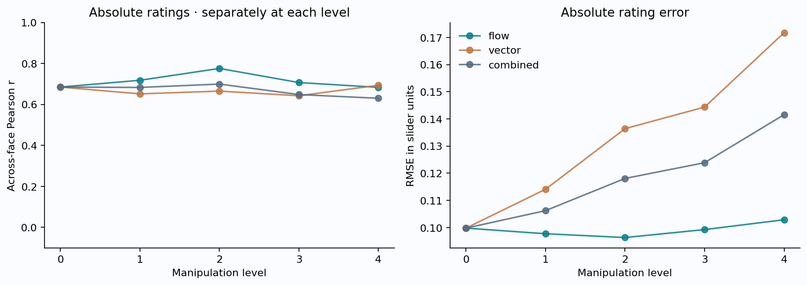
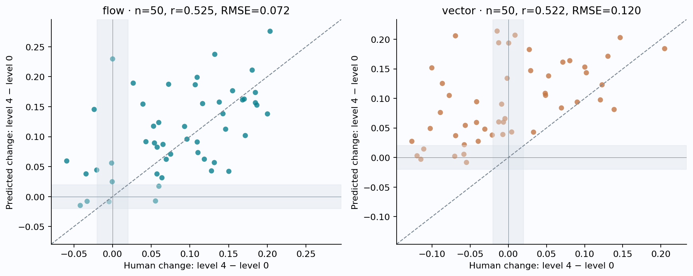
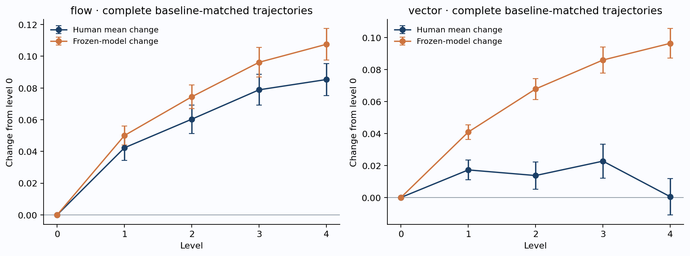
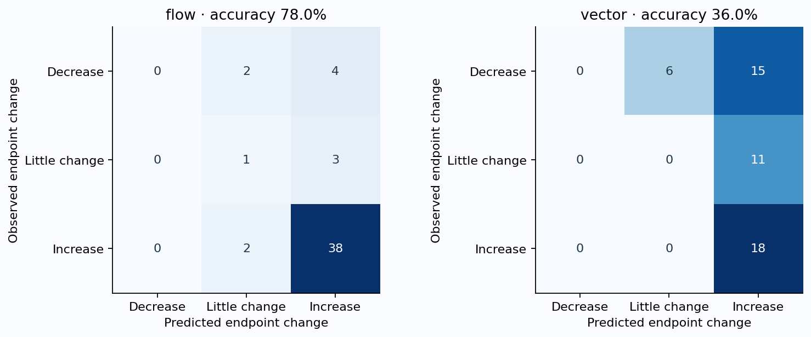
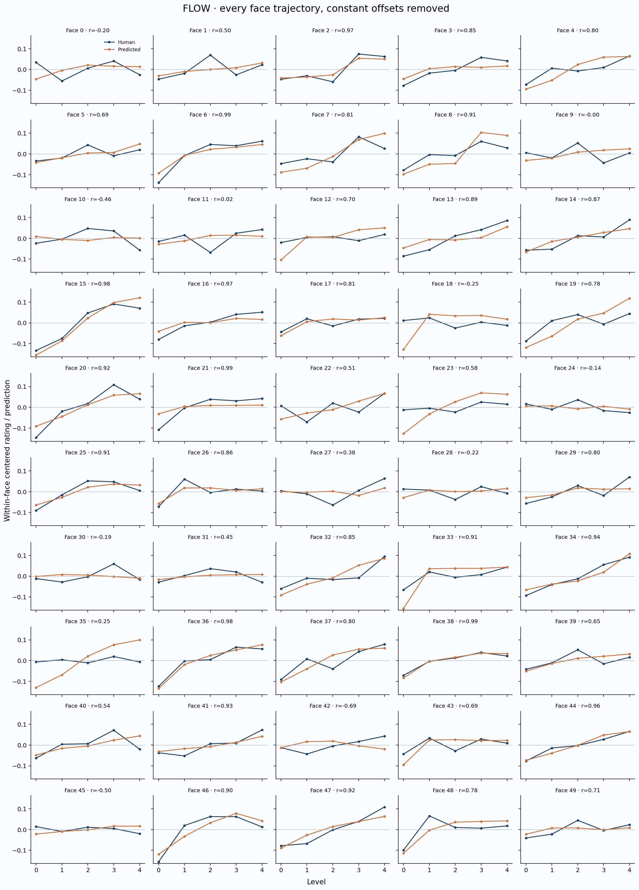
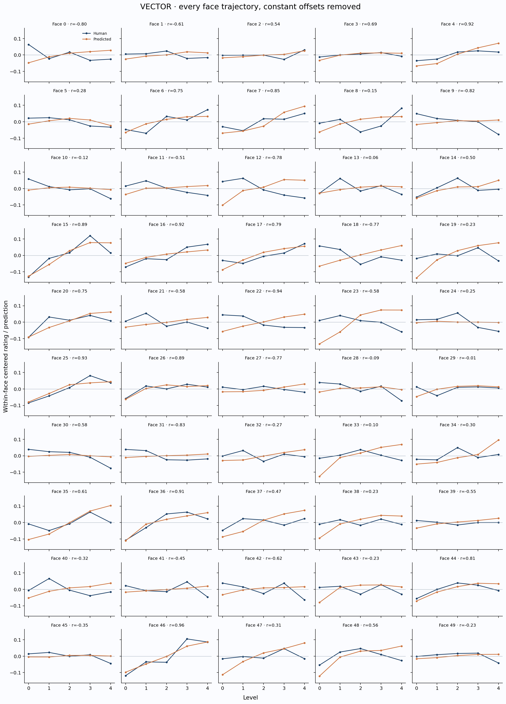

# Frozen-model test: trustworthiness manipulations

**FG-CLIP2 So400m · unchanged 256-phrase nonlinear ensemble · 9 September 2026**

On level-0 faces, the frozen model reaches **r=0.6846, RMSE=0.0998 (n=50)**. Absolute performance is substantially weaker than the original development-excluded result (r=.9380, RMSE=.0433). These samples differ, so this is a generalization diagnostic rather than a paired statistical comparison.

After removing each face-and-method trajectory’s constant offset, **flow r=0.6993, RMSE=0.0372**, versus **vector r=0.3162, RMSE=0.0476**. The model captures some manipulation variation, but this does not imply calibrated effect sizes or uniformly correct individual trajectories.

## Data matching and frozen-test integrity

- 500 supplied images containing `trustworthy`; 50 filename identities. All 50 faces have levels 1–4 for both methods. There are 50 vector level-0 files and 31 flow level-0 files.
- All 31 existing flow/vector level-0 pairs are byte-identical. Vector level-0 filenames have no exact rating keys. Their corresponding `flow_level_0.png` rating keys exist.
- Owner confirmation for all shared baselines: **True**. Without confirmation, only byte-identical existing baseline pairs receive aliased ratings. Missing flow baseline files are never silently invented.
- 500 rated method/image rows; 450 unique rows in combined absolute statistics. A common level-0 image is counted once per identity in combined absolute results, but serves as the baseline of both method trajectories.
- 0 supplied images remain without a verified rating match. Ratings per included image: 26–42. The complete join and provenance are in `rated_predictions.csv`.
- No fitting, calibration, prompt selection, weight changes or hyperparameter selection used these ratings. The original joblib hash is recorded in both input and result manifests. Every supplied image has a saved frozen prediction, even if its rating mapping is unconfirmed.

## Absolute accuracy within each level

| Subset | Level | n | Pearson r | R² | RMSE | MAE |
|---|---:|---:|---:|---:|---:|---:|
| combined | 0 | 50 | 0.6846 | -0.3453 | 0.0998 | 0.0815 |
| combined | 1 | 100 | 0.6827 | -0.9181 | 0.1062 | 0.0873 |
| combined | 2 | 100 | 0.6992 | -1.3122 | 0.1181 | 0.1019 |
| combined | 3 | 100 | 0.6480 | -1.6335 | 0.1239 | 0.1086 |
| combined | 4 | 100 | 0.6298 | -1.9894 | 0.1416 | 0.1274 |
| flow | 0 | 50 | 0.6846 | -0.3453 | 0.0998 | 0.0815 |
| flow | 1 | 50 | 0.7177 | -0.6878 | 0.0977 | 0.0791 |
| flow | 2 | 50 | 0.7755 | -0.6125 | 0.0963 | 0.0826 |
| flow | 3 | 50 | 0.7066 | -1.2587 | 0.0992 | 0.0874 |
| flow | 4 | 50 | 0.6830 | -1.4115 | 0.1029 | 0.0925 |
| vector | 0 | 50 | 0.6846 | -0.3453 | 0.0998 | 0.0815 |
| vector | 1 | 50 | 0.6513 | -1.2472 | 0.1141 | 0.0955 |
| vector | 2 | 50 | 0.6649 | -2.5646 | 0.1364 | 0.1212 |
| vector | 3 | 50 | 0.6422 | -2.6456 | 0.1444 | 0.1298 |
| vector | 4 | 50 | 0.6934 | -4.4452 | 0.1717 | 0.1623 |

A negative R² means the prediction error exceeds the variance of observed ratings in that subset. A positive correlation can coexist with poor calibration and negative R². Shared baselines make the two method-specific level-0 rows identical; they are not independent replications.

## Manipulation efficacy: remove offsets, preserve changes

For each identity × method, centered values are y(level) − mean(y) and prediction(level) − mean(prediction), calculated over that trajectory’s available levels. Their pooled correlation measures within-trajectory covariation; centered RMSE measures shape/amplitude error after removing the best constant offset. This diagnostic uses observed means to factor out bias; it is not a deployable test-set recalibration and does not rescale amplitude or repair slope errors.

Baseline changes are level k − level 0. Endpoint changes use level 4 − level 0. Adjacent changes use consecutive available levels. Slopes are OLS slopes against level index, separately for human and predicted trajectories. Slope comparison uses indices descriptively and does not assume ratings increase monotonically.

| Subset | Diagnostic | n | Pearson r | R² | RMSE |
|---|---|---:|---:|---:|---:|
| combined | Centered trajectory | 500 | 0.5393 | -0.0008 | 0.0427 |
| combined | All changes from baseline | 400 | 0.4655 | -0.1866 | 0.0780 |
| combined | Adjacent changes | 400 | 0.3849 | 0.0181 | 0.0505 |
| combined | Endpoint change | 100 | 0.4928 | -0.3074 | 0.0988 |
| combined | Per-face slope | 100 | 0.4913 | -0.3335 | 0.0242 |
| flow | Centered trajectory | 250 | 0.6993 | 0.3752 | 0.0372 |
| flow | All changes from baseline | 200 | 0.4978 | 0.0028 | 0.0665 |
| flow | Adjacent changes | 200 | 0.4046 | 0.0878 | 0.0497 |
| flow | Endpoint change | 50 | 0.5247 | -0.0354 | 0.0720 |
| flow | Per-face slope | 50 | 0.5150 | -0.1832 | 0.0179 |
| vector | Centered trajectory | 250 | 0.3162 | -0.5827 | 0.0476 |
| vector | All changes from baseline | 200 | 0.4433 | -0.7587 | 0.0880 |
| vector | Adjacent changes | 200 | 0.3585 | -0.1639 | 0.0512 |
| vector | Endpoint change | 50 | 0.5215 | -1.2640 | 0.1198 |
| vector | Per-face slope | 50 | 0.5429 | -1.0941 | 0.0292 |

The n column counts rows, changes or slopes, not independent observations. Repeated levels and methods share identities. The combined centered metric retains both method trajectories; the baseline deduplication applies only to absolute metrics.

Mean-change error bars are ±1 standard error across complete, baseline-matched face trajectories. They describe variability across faces, not independent participant uncertainty. The shaded endpoint-scatter bands mark ±.02 slider units.

| Subset | Change to level | n | Pearson r | RMSE |
|---|---:|---:|---:|---:|
| combined | 1 | 100 | 0.4444 | 0.0508 |
| combined | 2 | 100 | 0.3705 | 0.0740 |
| combined | 3 | 100 | 0.5095 | 0.0806 |
| combined | 4 | 100 | 0.4928 | 0.0988 |
| flow | 1 | 50 | 0.4524 | 0.0527 |
| flow | 2 | 50 | 0.3104 | 0.0693 |
| flow | 3 | 50 | 0.4821 | 0.0703 |
| flow | 4 | 50 | 0.5247 | 0.0720 |
| vector | 1 | 50 | 0.3941 | 0.0488 |
| vector | 2 | 50 | 0.4456 | 0.0784 |
| vector | 3 | 50 | 0.5591 | 0.0898 |
| vector | 4 | 50 | 0.5215 | 0.1198 |

### Baseline-independent sensitivity: levels 1–4 only

This comparison uses all 50 identities per method and only exactly matched ratings. Every trajectory has four levels, so neither missing baseline images nor rating aliases affect these results.

| Subset | Centered r | Centered RMSE | Slope r | Slope RMSE | Median per-face shape r |
|---|---:|---:|---:|---:|---:|
| combined | 0.3702 | 0.0365 | 0.4203 | 0.0257 | 0.3006 |
| flow | 0.5430 | 0.0325 | 0.4462 | 0.0203 | 0.5207 |
| vector | 0.1605 | 0.0401 | 0.4734 | 0.0301 | -0.1611 |

## Increase, decrease or little change

The primary descriptive neutral band is ±.02 slider units for the endpoint change. It is an explicit practical threshold, not a validated perceptual equivalence margin. A non-significant effect is not automatically “no change.” Both human and predicted changes use the same threshold.

| Method | Neutral band | Accuracy | Balanced accuracy | Majority-class baseline | Always little-change baseline |
|---|---:|---:|---:|---:|---:|
| combined | ±0.0 | 66.0% | 55.8% | 62.0% | 0.0% |
| combined | ±0.01 | 59.0% | 36.6% | 58.0% | 12.0% |
| combined | ±0.02 | 57.0% | 34.4% | 58.0% | 15.0% |
| combined | ±0.03 | 55.0% | 35.3% | 55.0% | 21.0% |
| combined | ±0.05 | 56.0% | 41.5% | 50.0% | 33.0% |
| flow | ±0.0 | 86.0% | 65.4% | 82.0% | 0.0% |
| flow | ±0.01 | 82.0% | 46.4% | 80.0% | 8.0% |
| flow | ±0.02 | 78.0% | 40.0% | 80.0% | 8.0% |
| flow | ±0.03 | 78.0% | 41.1% | 78.0% | 14.0% |
| flow | ±0.05 | 74.0% | 44.6% | 74.0% | 24.0% |
| vector | ±0.0 | 46.0% | 53.4% | 58.0% | 0.0% |
| vector | ±0.01 | 36.0% | 33.3% | 48.0% | 16.0% |
| vector | ±0.02 | 36.0% | 33.3% | 42.0% | 22.0% |
| vector | ±0.03 | 32.0% | 33.3% | 40.0% | 28.0% |
| vector | ±0.05 | 38.0% | 42.9% | 42.0% | 42.0% |

At ±.02: flow: 0 of 6 observed decreases correctly classified; vector: 0 of 21 observed decreases correctly classified. Compare ordinary accuracy with the majority-class baseline before judging individual manipulation selection. Balanced accuracy averages recall over human classes present in the subset. The threshold-zero row is a sign test with a possible exact-zero class. A high ordinary accuracy can reflect a dominant increase class, which is why the baselines and full confusion matrices are included.

| Method | Endpoint RMSE | Always-zero-change RMSE | Noise-separated endpoints | Sign accuracy on those endpoints |
|---|---:|---:|---:|---:|
| combined | 0.0988 | 0.0965 | 36 | 91.7% |
| flow | 0.0720 | 0.1108 | 24 | 100.0% |
| vector | 0.1198 | 0.0796 | 12 | 75.0% |

The optional noise screen requires |human endpoint change| > 1.96√(SEM₀² + SEM₄²). It omits shared-rater covariance and is approximate. Near-zero observed changes can be noisy, especially with 26–42 ratings per image.

## Comparing the manipulation methods

Paired identity bootstrap (3,000 resamples, both methods and all available levels kept together): 95% intervals for **flow minus vector RMSE** are [-0.015245446376838761, -0.005567221703520267] for centered trajectories and [-0.06433118529169647, -0.030966062976721356] for endpoints. Negative differences favor flow. These intervals condition on the frozen model and observed rating means, and do not resample participants.

RMSE and correlation answer different questions. Lower error for one method can reflect its effect-size distribution as well as model alignment; inspect the actual/predicted changes and zero-change baseline before concluding that a method is intrinsically easier.

## Every face trajectory

All identities are shown below with the same vertical scale across both methods. Blue is human, orange is predicted. Each curve has its own trajectory mean removed. Missing baseline matches produce a four-level curve starting at level 1; complete trajectories start at 0. No examples were selected by performance.

| Method | Identity | Levels | Shape r | Centered RMSE | Human slope | Predicted slope | Human endpoint | Predicted endpoint |
|---|---|---|---:|---:|---:|---:|---:|---:|
| flow | study4_trustworthy_0 | 0,1,2,3,4 | -0.2000 | 0.0476 | -0.0022 | 0.0139 | -0.0592 | 0.0594 |
| flow | study4_trustworthy_10 | 0,1,2,3,4 | -0.4599 | 0.0418 | -0.0026 | -0.0006 | -0.0328 | -0.0078 |
| flow | study4_trustworthy_11 | 0,1,2,3,4 | 0.0234 | 0.0419 | 0.0124 | 0.0103 | 0.0574 | 0.0378 |
| flow | study4_trustworthy_12 | 0,1,2,3,4 | 0.6966 | 0.0463 | 0.0063 | 0.0343 | 0.0393 | 0.1543 |
| flow | study4_trustworthy_13 | 0,1,2,3,4 | 0.8885 | 0.0368 | 0.0439 | 0.0212 | 0.1715 | 0.1018 |
| flow | study4_trustworthy_14 | 0,1,2,3,4 | 0.8652 | 0.0276 | 0.0351 | 0.0268 | 0.1461 | 0.1124 |
| flow | study4_trustworthy_15 | 0,1,2,3,4 | 0.9769 | 0.0274 | 0.0573 | 0.0736 | 0.2035 | 0.2757 |
| flow | study4_trustworthy_16 | 0,1,2,3,4 | 0.9664 | 0.0264 | 0.0318 | 0.0132 | 0.1315 | 0.0568 |
| flow | study4_trustworthy_17 | 0,1,2,3,4 | 0.8144 | 0.0184 | 0.0128 | 0.0182 | 0.0652 | 0.0871 |
| flow | study4_trustworthy_18 | 0,1,2,3,4 | -0.2544 | 0.0708 | -0.0068 | 0.0285 | -0.0237 | 0.1454 |
| flow | study4_trustworthy_19 | 0,1,2,3,4 | 0.7751 | 0.0554 | 0.0247 | 0.0586 | 0.1321 | 0.2373 |
| flow | study4_trustworthy_1 | 0,1,2,3,4 | 0.5021 | 0.0358 | 0.0132 | 0.0143 | 0.0694 | 0.0622 |
| flow | study4_trustworthy_20 | 0,1,2,3,4 | 0.9220 | 0.0367 | 0.0497 | 0.0416 | 0.1846 | 0.1566 |
| flow | study4_trustworthy_21 | 0,1,2,3,4 | 0.9893 | 0.0407 | 0.0334 | 0.0090 | 0.1503 | 0.0422 |
| flow | study4_trustworthy_22 | 0,1,2,3,4 | 0.5088 | 0.0443 | 0.0167 | 0.0304 | 0.0597 | 0.1236 |
| flow | study4_trustworthy_23 | 0,1,2,3,4 | 0.5786 | 0.0643 | 0.0083 | 0.0480 | 0.0267 | 0.1892 |
| flow | study4_trustworthy_24 | 0,1,2,3,4 | -0.1379 | 0.0247 | -0.0089 | -0.0031 | -0.0417 | -0.0147 |
| flow | study4_trustworthy_25 | 0,1,2,3,4 | 0.9128 | 0.0228 | 0.0255 | 0.0256 | 0.0962 | 0.0958 |
| flow | study4_trustworthy_26 | 0,1,2,3,4 | 0.8607 | 0.0230 | 0.0102 | 0.0130 | 0.0751 | 0.0709 |
| flow | study4_trustworthy_27 | 0,1,2,3,4 | 0.3829 | 0.0381 | 0.0137 | 0.0019 | 0.0599 | 0.0173 |
| flow | study4_trustworthy_28 | 0,1,2,3,4 | -0.2246 | 0.0288 | -0.0024 | 0.0084 | -0.0204 | 0.0444 |
| flow | study4_trustworthy_29 | 0,1,2,3,4 | 0.7953 | 0.0321 | 0.0262 | 0.0114 | 0.1278 | 0.0429 |
| flow | study4_trustworthy_2 | 0,1,2,3,4 | 0.9682 | 0.0188 | 0.0324 | 0.0272 | 0.1094 | 0.0911 |
| flow | study4_trustworthy_30 | 0,1,2,3,4 | -0.1879 | 0.0325 | 0.0079 | -0.0027 | -0.0045 | -0.0084 |
| flow | study4_trustworthy_31 | 0,1,2,3,4 | 0.4540 | 0.0235 | 0.0017 | 0.0060 | -0.0004 | 0.0248 |
| flow | study4_trustworthy_32 | 0,1,2,3,4 | 0.8469 | 0.0337 | 0.0312 | 0.0444 | 0.1551 | 0.1765 |
| flow | study4_trustworthy_33 | 0,1,2,3,4 | 0.9073 | 0.0470 | 0.0206 | 0.0400 | 0.1093 | 0.1989 |
| flow | study4_trustworthy_34 | 0,1,2,3,4 | 0.9431 | 0.0221 | 0.0465 | 0.0405 | 0.1846 | 0.1737 |
| flow | study4_trustworthy_35 | 0,1,2,3,4 | 0.2460 | 0.0849 | 0.0016 | 0.0604 | 0.0001 | 0.2296 |
| flow | study4_trustworthy_36 | 0,1,2,3,4 | 0.9760 | 0.0169 | 0.0428 | 0.0492 | 0.1804 | 0.2109 |
| flow | study4_trustworthy_37 | 0,1,2,3,4 | 0.8029 | 0.0385 | 0.0375 | 0.0420 | 0.1701 | 0.1627 |
| flow | study4_trustworthy_38 | 0,1,2,3,4 | 0.9921 | 0.0078 | 0.0229 | 0.0273 | 0.0931 | 0.1170 |
| flow | study4_trustworthy_39 | 0,1,2,3,4 | 0.6464 | 0.0258 | 0.0111 | 0.0200 | 0.0577 | 0.0824 |
| flow | study4_trustworthy_3 | 0,1,2,3,4 | 0.8480 | 0.0308 | 0.0313 | 0.0131 | 0.1186 | 0.0624 |
| flow | study4_trustworthy_40 | 0,1,2,3,4 | 0.5429 | 0.0375 | 0.0154 | 0.0223 | 0.0432 | 0.0916 |
| flow | study4_trustworthy_41 | 0,1,2,3,4 | 0.9314 | 0.0219 | 0.0283 | 0.0178 | 0.1104 | 0.0734 |
| flow | study4_trustworthy_42 | 0,1,2,3,4 | -0.6937 | 0.0412 | 0.0171 | -0.0034 | 0.0555 | -0.0072 |
| flow | study4_trustworthy_43 | 0,1,2,3,4 | 0.6922 | 0.0343 | 0.0101 | 0.0232 | 0.0530 | 0.1174 |
| flow | study4_trustworthy_44 | 0,1,2,3,4 | 0.9614 | 0.0145 | 0.0327 | 0.0363 | 0.1427 | 0.1382 |
| flow | study4_trustworthy_45 | 0,1,2,3,4 | -0.5028 | 0.0241 | -0.0054 | 0.0102 | -0.0342 | 0.0379 |
| flow | study4_trustworthy_46 | 0,1,2,3,4 | 0.9025 | 0.0348 | 0.0378 | 0.0433 | 0.1680 | 0.1612 |
| flow | study4_trustworthy_47 | 0,1,2,3,4 | 0.9230 | 0.0286 | 0.0480 | 0.0370 | 0.1865 | 0.1526 |
| flow | study4_trustworthy_48 | 0,1,2,3,4 | 0.7767 | 0.0380 | 0.0174 | 0.0352 | 0.1163 | 0.1551 |
| flow | study4_trustworthy_49 | 0,1,2,3,4 | 0.7147 | 0.0236 | 0.0145 | 0.0055 | 0.0638 | 0.0315 |
| flow | study4_trustworthy_4 | 0,1,2,3,4 | 0.7994 | 0.0382 | 0.0279 | 0.0426 | 0.1379 | 0.1576 |
| flow | study4_trustworthy_5 | 0,1,2,3,4 | 0.6861 | 0.0230 | 0.0119 | 0.0204 | 0.0542 | 0.0895 |
| flow | study4_trustworthy_6 | 0,1,2,3,4 | 0.9946 | 0.0244 | 0.0448 | 0.0316 | 0.2002 | 0.1379 |
| flow | study4_trustworthy_7 | 0,1,2,3,4 | 0.8109 | 0.0448 | 0.0251 | 0.0513 | 0.0725 | 0.1873 |
| flow | study4_trustworthy_8 | 0,1,2,3,4 | 0.9077 | 0.0436 | 0.0277 | 0.0527 | 0.1069 | 0.1866 |
| flow | study4_trustworthy_9 | 0,1,2,3,4 | -0.0009 | 0.0387 | -0.0026 | 0.0150 | -0.0012 | 0.0560 |
| vector | study4_trustworthy_0 | 0,1,2,3,4 | -0.8020 | 0.0605 | -0.0189 | 0.0185 | -0.0892 | 0.0762 |
| vector | study4_trustworthy_10 | 0,1,2,3,4 | -0.1226 | 0.0398 | -0.0253 | 0.0003 | -0.1197 | 0.0029 |
| vector | study4_trustworthy_11 | 0,1,2,3,4 | -0.5067 | 0.0436 | -0.0183 | 0.0119 | -0.0565 | 0.0544 |
| vector | study4_trustworthy_12 | 0,1,2,3,4 | -0.7838 | 0.0972 | -0.0303 | 0.0370 | -0.1003 | 0.1517 |
| vector | study4_trustworthy_13 | 0,1,2,3,4 | 0.0551 | 0.0384 | -0.0059 | 0.0099 | -0.0072 | 0.0389 |
| vector | study4_trustworthy_14 | 0,1,2,3,4 | 0.4988 | 0.0364 | 0.0081 | 0.0242 | 0.0483 | 0.1086 |
| vector | study4_trustworthy_15 | 0,1,2,3,4 | 0.8883 | 0.0380 | 0.0432 | 0.0539 | 0.1466 | 0.2029 |
| vector | study4_trustworthy_16 | 0,1,2,3,4 | 0.9211 | 0.0275 | 0.0348 | 0.0196 | 0.1387 | 0.0812 |
| vector | study4_trustworthy_17 | 0,1,2,3,4 | 0.7861 | 0.0322 | 0.0268 | 0.0356 | 0.1023 | 0.1434 |
| vector | study4_trustworthy_18 | 0,1,2,3,4 | -0.7678 | 0.0804 | -0.0218 | 0.0313 | -0.0865 | 0.1253 |
| vector | study4_trustworthy_19 | 0,1,2,3,4 | 0.2322 | 0.0757 | 0.0008 | 0.0514 | -0.0147 | 0.2139 |
| vector | study4_trustworthy_1 | 0,1,2,3,4 | -0.6075 | 0.0288 | -0.0071 | 0.0102 | -0.0211 | 0.0380 |
| vector | study4_trustworthy_20 | 0,1,2,3,4 | 0.7492 | 0.0379 | 0.0210 | 0.0392 | 0.1002 | 0.1530 |
| vector | study4_trustworthy_21 | 0,1,2,3,4 | -0.5830 | 0.0469 | -0.0137 | 0.0149 | -0.0418 | 0.0593 |
| vector | study4_trustworthy_22 | 0,1,2,3,4 | -0.9409 | 0.0706 | -0.0224 | 0.0265 | -0.0775 | 0.1050 |
| vector | study4_trustworthy_23 | 0,1,2,3,4 | -0.5793 | 0.1045 | -0.0180 | 0.0545 | -0.0693 | 0.2059 |
| vector | study4_trustworthy_24 | 0,1,2,3,4 | 0.2521 | 0.0387 | -0.0190 | -0.0001 | -0.0703 | 0.0022 |
| vector | study4_trustworthy_25 | 0,1,2,3,4 | 0.9315 | 0.0226 | 0.0369 | 0.0311 | 0.1229 | 0.1230 |
| vector | study4_trustworthy_26 | 0,1,2,3,4 | 0.8863 | 0.0151 | 0.0150 | 0.0179 | 0.0696 | 0.0839 |
| vector | study4_trustworthy_27 | 0,1,2,3,4 | -0.7702 | 0.0294 | -0.0061 | 0.0124 | -0.0308 | 0.0480 |
| vector | study4_trustworthy_28 | 0,1,2,3,4 | -0.0894 | 0.0425 | -0.0235 | 0.0038 | -0.1109 | 0.0144 |
| vector | study4_trustworthy_29 | 0,1,2,3,4 | -0.0097 | 0.0322 | 0.0041 | 0.0141 | -0.0065 | 0.0598 |
| vector | study4_trustworthy_2 | 0,1,2,3,4 | 0.5434 | 0.0162 | 0.0040 | 0.0100 | 0.0330 | 0.0429 |
| vector | study4_trustworthy_30 | 0,1,2,3,4 | 0.5756 | 0.0383 | -0.0263 | -0.0008 | -0.1147 | -0.0030 |
| vector | study4_trustworthy_31 | 0,1,2,3,4 | -0.8260 | 0.0351 | -0.0174 | 0.0051 | -0.0578 | 0.0217 |
| vector | study4_trustworthy_32 | 0,1,2,3,4 | -0.2696 | 0.0375 | -0.0031 | 0.0177 | -0.0045 | 0.0658 |
| vector | study4_trustworthy_33 | 0,1,2,3,4 | 0.0966 | 0.0699 | -0.0026 | 0.0451 | -0.0127 | 0.1941 |
| vector | study4_trustworthy_34 | 0,1,2,3,4 | 0.3047 | 0.0511 | 0.0072 | 0.0342 | 0.0293 | 0.1470 |
| vector | study4_trustworthy_35 | 0,1,2,3,4 | 0.6134 | 0.0636 | 0.0130 | 0.0554 | 0.0088 | 0.2070 |
| vector | study4_trustworthy_36 | 0,1,2,3,4 | 0.9094 | 0.0264 | 0.0356 | 0.0393 | 0.1306 | 0.1713 |
| vector | study4_trustworthy_37 | 0,1,2,3,4 | 0.4661 | 0.0546 | 0.0103 | 0.0430 | 0.0714 | 0.1614 |
| vector | study4_trustworthy_38 | 0,1,2,3,4 | 0.2337 | 0.0496 | 0.0001 | 0.0321 | -0.0016 | 0.1341 |
| vector | study4_trustworthy_39 | 0,1,2,3,4 | -0.5519 | 0.0263 | -0.0027 | 0.0141 | -0.0126 | 0.0602 |
| vector | study4_trustworthy_3 | 0,1,2,3,4 | 0.6912 | 0.0126 | 0.0023 | 0.0100 | 0.0043 | 0.0432 |
| vector | study4_trustworthy_40 | 0,1,2,3,4 | -0.3209 | 0.0534 | -0.0122 | 0.0209 | -0.0088 | 0.0903 |
| vector | study4_trustworthy_41 | 0,1,2,3,4 | -0.4497 | 0.0391 | -0.0084 | 0.0089 | -0.0691 | 0.0370 |
| vector | study4_trustworthy_42 | 0,1,2,3,4 | -0.6199 | 0.0525 | -0.0182 | 0.0113 | -0.1024 | 0.0491 |
| vector | study4_trustworthy_43 | 0,1,2,3,4 | -0.2329 | 0.0518 | -0.0074 | 0.0204 | -0.0416 | 0.0944 |
| vector | study4_trustworthy_44 | 0,1,2,3,4 | 0.8055 | 0.0239 | 0.0123 | 0.0264 | 0.0488 | 0.1052 |
| vector | study4_trustworthy_45 | 0,1,2,3,4 | -0.3471 | 0.0253 | -0.0131 | 0.0021 | -0.0583 | 0.0055 |
| vector | study4_trustworthy_46 | 0,1,2,3,4 | 0.9552 | 0.0276 | 0.0550 | 0.0477 | 0.2049 | 0.1842 |
| vector | study4_trustworthy_47 | 0,1,2,3,4 | 0.3142 | 0.0642 | 0.0049 | 0.0466 | 0.0004 | 0.1937 |
| vector | study4_trustworthy_48 | 0,1,2,3,4 | 0.5633 | 0.0531 | 0.0040 | 0.0406 | 0.0275 | 0.1827 |
| vector | study4_trustworthy_49 | 0,1,2,3,4 | -0.2343 | 0.0267 | -0.0070 | 0.0074 | -0.0395 | 0.0275 |
| vector | study4_trustworthy_4 | 0,1,2,3,4 | 0.9153 | 0.0320 | 0.0156 | 0.0372 | 0.0528 | 0.1381 |
| vector | study4_trustworthy_5 | 0,1,2,3,4 | 0.2820 | 0.0252 | -0.0160 | -0.0012 | -0.0549 | -0.0083 |
| vector | study4_trustworthy_6 | 0,1,2,3,4 | 0.7546 | 0.0345 | 0.0322 | 0.0238 | 0.1206 | 0.0975 |
| vector | study4_trustworthy_7 | 0,1,2,3,4 | 0.8517 | 0.0383 | 0.0231 | 0.0442 | 0.0805 | 0.1638 |
| vector | study4_trustworthy_8 | 0,1,2,3,4 | 0.1487 | 0.0549 | 0.0140 | 0.0230 | 0.0903 | 0.0938 |
| vector | study4_trustworthy_9 | 0,1,2,3,4 | -0.8211 | 0.0505 | -0.0273 | 0.0064 | -0.1265 | 0.0274 |

## Artifacts and reuse

- `image_predictions.csv`: all supplied-image predictions; `rated_predictions.csv`: included ratings and join provenance; `trajectory_metrics.csv`: individual manipulation metrics.
- `test_results.json`: all metrics, trajectories, confusion matrices and paired bootstrap intervals. `input_manifest.json` records image and frozen-model hashes. `frozen_predictions.npz` preserves all 512 score features; per-batch caches permit interrupted inference to resume.
- Reusable functions in `CLIP/fgclip2_face_impressions.py`: `encode_trust_testset`, `analyze_trust_testset`, `trust_change_metrics`, `report_trust_testset`. The model bundle remains unchanged. PNG and SVG versions of every figure accompany this self-contained HTML.
- These measurements concern subjective impressions of generated faces. They do not validate actual trustworthiness, and no claim is made that increasing level has a uniform psychological effect.
