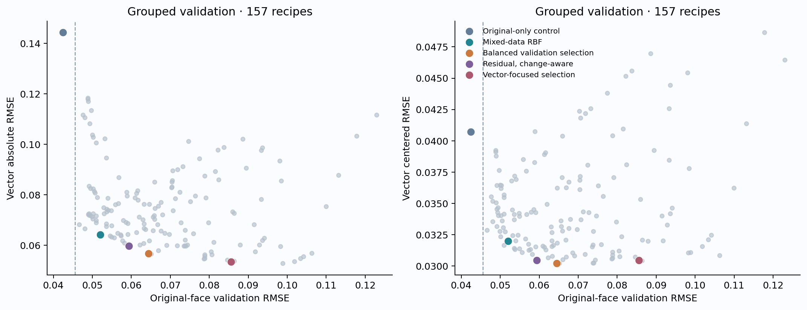
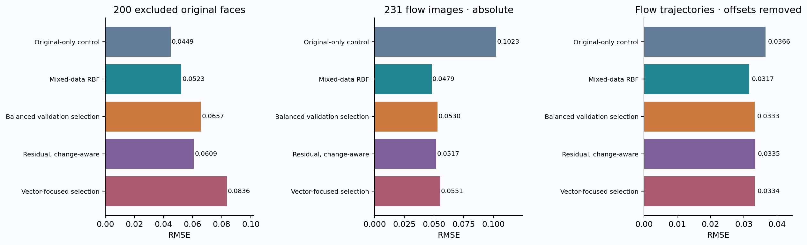
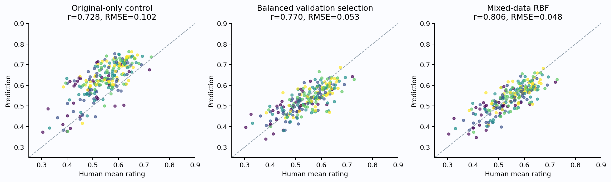
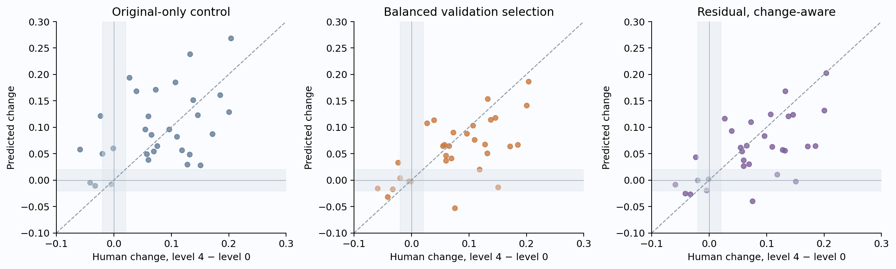
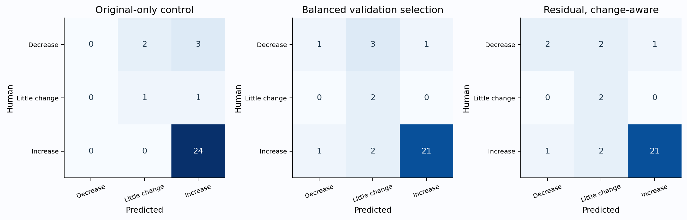

# Learning from vector manipulations: transfer to flow

**Frozen FG-CLIP2 So400m · 256 phrases / 512 scores · prediction-head adaptation · 9 September 2026**

Vector training improves absolute prediction on flow, with a cost to the original distribution. The head selected by balanced validation reduces **flow RMSE from 0.1023 to 0.0530**, while original-test RMSE rises from **0.0449 to 0.0657**. Its flow centered RMSE changes from 0.0366 to 0.0333.

This is stronger evidence for transfer of rating calibration than for reliable detection of subtle decreases. The adapted heads sometimes recover decreases, but there are few baseline-to-endpoint decrease cases and false alarms remain. All displayed adaptations were selected using original/vector validation; none were tuned from the new flow scores.

## Split and interpretation

- Original source: 804 faces for training/validation; 200 excluded faces for the current test. The 200 were sampled with seed 20260912 from the earlier 604 evaluation faces, keeping the 400 phrase-development faces in training.
- Vector training/validation: all 200 exactly rated images at levels 1–4, from 50 identities. Five-fold validation keeps every identity’s variants together. Original faces use corresponding five-fold splits.
- Flow test: all 231 supplied flow images, including the 31 available level-0 images and all 50 identities at levels 1–4. No flow rating key is dereferenced during model fitting or selection. Vector level-0 images are excluded because their rating aliases are flow baseline keys.
- Source-only control is refitted from scratch on the 804 source-training faces using the previous fixed architecture. The earlier all-1,004-face fitted weights are not reused for fitting or evaluation predictions.
- Flow and vector share identities. This tests generalization across manipulation methods on identities whose vector variants are available in training; it does not test unseen-identity generalization. No vector-training image is byte-identical to a flow test image.
- Both the original and flow datasets have already been inspected in earlier research. The current split prevents direct training on test labels, but the results are an exploratory transfer experiment, not a pristine external validation. No original-study test fraction can restore its historical blindness.

## Why adapt the head this way

The new data contain many correlated variants of only 50 identities. Treating those rows as independent in validation would reward memorizing identity. Simply pooling all rows would also let the larger original dataset dominate the objective. We therefore group vector validation by identity, balance domain loss explicitly, and compare a loss that emphasizes within-identity variation.

The encoder and all 256 phrases remain fixed. This isolates whether the existing score representation already contains useful information, with fewer trainable parameters than fine-tuning So400m. No model receives a method name, level index, identity ID or domain flag at prediction time; grouping affects training and evaluation only.

Three head strategies are compared: weighted mixed-data ridge/RBF refitting; a residual correction to the refitted original model; and the same correction with an additional within-identity change loss. Residual corrections use either linear score features or 128 Nyström RBF features. Standardization and Nyström landmarks are learned only from the current training fold. [Nyström documentation](https://scikit-learn.org/stable/modules/generated/sklearn.kernel_approximation.Nystroem.html); [grouped-validation guidance](https://scikit-learn.org/stable/modules/cross_validation.html).

For source model f₀ and learned correction δ, the residual objective is:

`mean_source(δ²) + η·mean_vector((δ − (y−f₀))²) + ηκ·mean_vector((Cδ − C(y−f₀))²) + λ‖β‖²`

C subtracts each training identity’s mean across vector levels. Thus κ emphasizes changes rather than identity offsets. Source replay penalizes changing f₀ on source images, without requiring vector-like labels for those images. An intercept is included and regularized. A single-image function remains deployable; no test rating is needed to predict a change. Weighted mixed-data refits instead fit source and vector ratings directly, assigning total vector loss η times total source loss.

## Validation decision and its revision



The original plan required source-validation MSE ≤1.15 times the source-only control. **None of the 156 adapted candidates met that bound**; the strict-retention decision keeps the source-only model. After inspecting only validation results, before evaluating either current test set, we retained that result and added two declared comparisons:

- **Balanced selection:** minimize .50 original absolute NMSE + .35 vector absolute NMSE + .15 vector centered NMSE.
- **Vector-focused selection:** minimize .70 vector absolute NMSE + .30 vector centered NMSE, without a source-retention bound.

Each NMSE uses the corresponding training/validation pool’s target variance; centered vector variance is measured after identity centering. The 157-recipe grid was unchanged. Each strategy family’s comparison is its best balanced-validation recipe. CV scores are selection statistics, not unbiased performance estimates of the selected procedure. The dashed line in the figure is the rejected strict-retention bound.

| Decision | Original validation RMSE | Vector validation RMSE | Vector centered RMSE |
|---|---:|---:|---:|
| Original-only control | 0.0424 | 0.1443 | 0.0407 |
| Mixed-data RBF | 0.0520 | 0.0642 | 0.0320 |
| Balanced validation selection | 0.0645 | 0.0568 | 0.0302 |
| Residual, change-aware | 0.0593 | 0.0597 | 0.0305 |
| Vector-focused selection | 0.0856 | 0.0535 | 0.0304 |

Selected recipes were saved before opening current test outcomes:

```json
{
  "source_only": {
    "family": "source_only"
  },
  "retention_15": {
    "family": "source_only"
  },
  "pooled": {
    "family": "pooled_rbf",
    "alpha": 0.1,
    "vector_weight": 1.0
  },
  "residual_absolute": {
    "family": "residual",
    "mapping": "nystrom",
    "alpha": 0.001,
    "vector_weight": 4.0,
    "contrast": 0.0
  },
  "residual_contrast": {
    "family": "residual",
    "mapping": "nystrom",
    "alpha": 0.001,
    "vector_weight": 1.0,
    "contrast": 4.0
  },
  "selected": {
    "family": "residual",
    "mapping": "nystrom",
    "alpha": 0.001,
    "vector_weight": 4.0,
    "contrast": 0.0
  },
  "vector_focused": {
    "family": "residual",
    "mapping": "nystrom",
    "alpha": 0.01,
    "vector_weight": 16.0,
    "contrast": 1.0
  }
}
```

## Original-face retention and flow transfer



| Model | Original r | Original RMSE | Flow r | Flow RMSE | Flow centered r | Flow centered RMSE |
|---|---:|---:|---:|---:|---:|---:|
| Original-only control | 0.9358 | 0.0449 | 0.7284 | 0.1023 | 0.6278 | 0.0366 |
| Mixed-data RBF | 0.9111 | 0.0523 | 0.8062 | 0.0479 | 0.6814 | 0.0317 |
| Balanced validation selection | 0.8609 | 0.0657 | 0.7697 | 0.0530 | 0.6315 | 0.0333 |
| Residual, change-aware | 0.8810 | 0.0609 | 0.7598 | 0.0517 | 0.6275 | 0.0335 |
| Vector-focused selection | 0.8282 | 0.0836 | 0.7701 | 0.0551 | 0.6350 | 0.0334 |

The mixed-data RBF comparator performs better than the balanced selection on both current tests. That is a post-test observation, not a reason to relabel it as the preselected winner. Its artifact is retained as a candidate for an independent next test.

For balanced selection versus source-only, paired identity-bootstrap 95% intervals for flow RMSE reduction are **[0.03496636676810317, 0.06340574548672524]** for absolute ratings and **[-0.0008902644179850985, 0.007345166997170079]** after removing trajectory offsets. The centered interval includes zero. The 3,000 bootstrap resamples keep each identity’s available levels together; intervals condition on observed ratings and do not include participant or training uncertainty.



| Model | Level | n | Flow r | Flow R² | Flow RMSE |
|---|---:|---:|---:|---:|---:|
| Original-only control | 0 | 31 | 0.5938 | -0.6202 | 0.1166 |
| Original-only control | 1 | 50 | 0.7121 | -0.7210 | 0.0987 |
| Original-only control | 2 | 50 | 0.7705 | -0.6550 | 0.0976 |
| Original-only control | 3 | 50 | 0.7004 | -1.2988 | 0.1001 |
| Original-only control | 4 | 50 | 0.6776 | -1.4341 | 0.1033 |
| Mixed-data RBF | 0 | 31 | 0.7918 | 0.6260 | 0.0560 |
| Mixed-data RBF | 1 | 50 | 0.8261 | 0.6457 | 0.0448 |
| Mixed-data RBF | 2 | 50 | 0.7598 | 0.5481 | 0.0510 |
| Mixed-data RBF | 3 | 50 | 0.7740 | 0.5499 | 0.0443 |
| Mixed-data RBF | 4 | 50 | 0.7387 | 0.5223 | 0.0458 |
| Balanced validation selection | 0 | 31 | 0.7697 | 0.5922 | 0.0585 |
| Balanced validation selection | 1 | 50 | 0.7977 | 0.5934 | 0.0480 |
| Balanced validation selection | 2 | 50 | 0.7169 | 0.4605 | 0.0557 |
| Balanced validation selection | 3 | 50 | 0.7257 | 0.4004 | 0.0511 |
| Balanced validation selection | 4 | 50 | 0.7052 | 0.3592 | 0.0530 |
| Residual, change-aware | 0 | 31 | 0.7441 | 0.5341 | 0.0625 |
| Residual, change-aware | 1 | 50 | 0.7713 | 0.5851 | 0.0484 |
| Residual, change-aware | 2 | 50 | 0.7253 | 0.5107 | 0.0531 |
| Residual, change-aware | 3 | 50 | 0.7205 | 0.4707 | 0.0480 |
| Residual, change-aware | 4 | 50 | 0.6981 | 0.4394 | 0.0496 |
| Vector-focused selection | 0 | 31 | 0.7913 | 0.6226 | 0.0563 |
| Vector-focused selection | 1 | 50 | 0.7888 | 0.5668 | 0.0495 |
| Vector-focused selection | 2 | 50 | 0.7193 | 0.4232 | 0.0576 |
| Vector-focused selection | 3 | 50 | 0.7266 | 0.3013 | 0.0552 |
| Vector-focused selection | 4 | 50 | 0.7315 | 0.2654 | 0.0568 |

## Can it predict decreases?

Endpoint direction uses a ±.02 slider-unit neutral band, unchanged from the previous evaluation. There are only 31 complete baseline-matched flow trajectories: five decreases, two little-change cases and 24 increases. These small class counts make decrease recall uncertain.





| Model | Endpoint r | Endpoint RMSE | Decreases recovered | False decrease calls | Accuracy | Balanced accuracy |
|---|---:|---:|---:|---:|---:|---:|
| Original-only control | 0.4594 | 0.0757 | 0/5 | 0 | 80.6% | 50.0% |
| Mixed-data RBF | 0.6161 | 0.0579 | 0/5 | 0 | 74.2% | 62.5% |
| Balanced validation selection | 0.6232 | 0.0610 | 1/5 | 1 | 77.4% | 69.2% |
| Residual, change-aware | 0.6215 | 0.0616 | 2/5 | 1 | 80.6% | 75.8% |
| Vector-focused selection | 0.6721 | 0.0629 | 2/5 | 1 | 80.6% | 75.8% |

Within-face centered statistics remove one constant error per trajectory, without changing slope or amplitude. The following comparison uses levels 1–4 only for all 50 flow identities, matching the range available in vector training. It avoids baseline aliases entirely.

| Model | Centered r | Centered RMSE | Slope r | Change 4−1 r | Change 4−1 RMSE | Decreases 4−1 recovered | False decrease calls |
|---|---:|---:|---:|---:|---:|---:|---:|
| Original-only control | 0.5442 | 0.0325 | 0.4396 | 0.4159 | 0.0628 | 1/7 | 1 |
| Mixed-data RBF | 0.5665 | 0.0297 | 0.4766 | 0.4814 | 0.0517 | 0/7 | 1 |
| Balanced validation selection | 0.5398 | 0.0299 | 0.4796 | 0.4625 | 0.0520 | 2/7 | 1 |
| Residual, change-aware | 0.5285 | 0.0302 | 0.4513 | 0.4307 | 0.0544 | 2/7 | 2 |
| Vector-focused selection | 0.5390 | 0.0297 | 0.4854 | 0.4719 | 0.0526 | 2/7 | 2 |

The change-aware head can recover some decreases, but it is not uniformly more accurate than ordinary refitting. Higher decline recall must be weighed against false decrease calls, source-distribution degradation and variability in participant mean ratings. This experiment does not justify treating the adapted model as a reliable manipulation-success detector.

## Frozen artifacts and reuse

`transfer_model.joblib` contains the balanced validation selection. `pooled_model.joblib` and `contrast_model.joblib` contain the declared family comparators. They support the same `TrustworthinessPredictor.load(...).predict_images(...)` API as the original model. They do not require method or level labels. The original published model bundle remains unchanged.

```python
from CLIP.fgclip2_face_impressions import TrustworthinessPredictor
model = TrustworthinessPredictor.load('/Users/adamsobieszek/PycharmProjects/psych_gen_app/CLIP/research/trustworthiness_vector_transfer/transfer_model.joblib')
means = model.predict_images(["/path/to/face_a.png", "/path/to/face_b.png"])
```

Reusable functions are in `CLIP/fgclip2_face_impressions.py`: `transfer_center_groups`, `fit_trust_transfer`, `trust_transfer_cv`, `run_trust_transfer`, `freeze_trust_transfer_tradeoffs`, `evaluate_trust_transfer`, and `report_trust_transfer`. `REPRODUCE.md` gives the exact sequence.

The protocol records every original split index, vector training filename and flow test filename. Validation artifacts retain every candidate, grouped fold and OOF prediction. Test CSVs retain every model’s prediction. Manifests and source snapshots preserve model and input hashes. No new encoder training or phrase generation was used; these results isolate adaptation of the frozen phrase-score representation.
